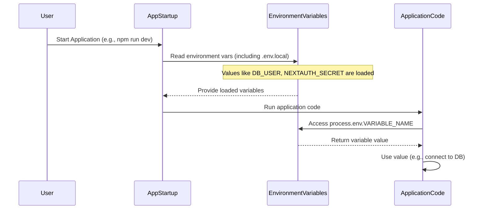

# Chapter 1: Environment Configuration

Welcome to the tutorial for the `merged-tally-helper` project! In this first chapter, we're going to tackle a fundamental concept in building secure and flexible applications: Environment Configuration.

Imagine you're building an application that needs to connect to a database. You need the database's address, username, and password. These are sensitive pieces of information! If you put them directly inside your code files, anyone who sees your code could see your secrets. This is a big security risk!

Also, what if you want to use a different database for testing than you do for the live application? You'd have to go into your code and change those details every time you switch. That's annoying and error-prone.

**Environment configuration** is a pattern that helps solve these problems. Instead of putting sensitive information directly *in* your code, you store it *outside* the code in special variables called **environment variables**. Your code then reads these variables when it needs the information.

Think of it like this: Your application is a chef. It needs ingredients (like API keys, database passwords) to cook (run). Instead of writing the ingredients list on the recipe card itself (the code), the chef looks for a separate note stuck to the fridge (the environment variables) that tells them where to find the ingredients for *this specific meal* (this specific environment, like development or production). The recipe card (code) stays the same!

## What are Environment Variables?

Environment variables are named values that are set *outside* your application's code, in the environment where the application is running. The application can then access these values.

In Node.js applications (like our `merged-tally-helper` project which uses Next.js), you can access environment variables using the `process.env` object.

For example, if you set an environment variable named `MY_SECRET_KEY` with the value `super-secret-value-123`, you can access it in your Node.js code like this:

```javascript
const secretKey = process.env.MY_SECRET_KEY;
console.log(secretKey); // This would print "super-secret-value-123"
```

## Why Use Environment Variables?

1.  **Security:** You keep sensitive information (passwords, API keys) out of your code files. This is especially important if you use version control systems like Git, as you don't accidentally commit secrets to a public or shared repository.
2.  **Flexibility:** You can easily change configuration settings (like API endpoints, database servers) without changing your application's code. You just change the environment variables in the environment where the application runs. This makes it easy to have different settings for development, testing, and production.

## Where Do Environment Variables Come From?

When you run an application locally during development, environment variables can come from several places:

*   Your operating system's environment.
*   Special files like `.env` files, which development frameworks (like Next.js) automatically read and load.

For this project, we primarily rely on `.env` files during local development.

## Solving the Use Case: Database Connection

Let's look at how our project uses environment variables to connect to the database, using code from the `lib/db.ts` file.

Here's a simplified version of the database connection setup:

```typescript
// lib/db.ts (Simplified)
import sql from "mssql";

const config: sql.config = {
  user: process.env.DB_USER,      // Get user from env var
  password: process.env.DB_PASSWORD, // Get password from env var
  database: process.env.DB_NAME,    // Get database name from env var
  server: process.env.DB_SERVER || "localhost", // Get server, default to localhost
  // ... other connection options
};

let pool: sql.ConnectionPool;

export async function getConnection() {
  if (!pool) {
    // Use the config object which has values from process.env
    pool = await sql.connect(config);
  }
  return pool;
}
```

Notice how the `config` object, which holds all the details needed to connect to the database, gets its values from `process.env.DB_USER`, `process.env.DB_PASSWORD`, `process.env.DB_NAME`, and `process.env.DB_SERVER`.

The code itself doesn't contain the actual username or password. It just knows to look for them in the environment variables named `DB_USER`, `DB_PASSWORD`, etc.

## Providing the Environment Variables (.env files)

So, where do these `process.env.DB_USER` values come from during local development? They typically come from a file named `.env.local` in the root of your project directory.

This project includes an example file called `.env.example`. This file shows you the *structure* of the environment variables your application expects, but it doesn't contain the actual secret values.

Here's what `.env.example` looks like (relevant parts):

```
# .env.example (Relevant parts)

DB_USER=          # Your database username goes here
DB_PASSWORD=      # Your database password goes here
DB_NAME=          # Your database name goes here
DB_SERVER=        # Your database server address goes here

NEXTAUTH_SECRET=  # A secret used for authentication
NEXTAUTH_URL=     # The URL your app is running on

# ... other variables for APIs etc.
SALES_URL=
URL_AUTHORIZATION=
URL_COOKIE=

CLOUD_URL=
CLOUD_AUTH_TOKEN=

# ... more API variables
```

To run the project locally and connect to your database, you would create a new file named `.env.local` in the same directory as `.env.example`. Then, you copy the contents of `.env.example` into `.env.local` and fill in the actual values for your specific database and other services.

```dotenv
# .env.local (Example with YOUR actual values)

DB_USER=my_db_user
DB_PASSWORD=my_super_secret_password_123
DB_NAME=tally_helper_db
DB_SERVER=your.database.server.com

NEXTAUTH_SECRET=some-long-random-string-for-nextauth
NEXTAUTH_URL=http://localhost:3000

SALES_URL=https://api.example.com/sales
URL_AUTHORIZATION=Bearer abcdef12345
URL_COOKIE=sessionid=xyz789

CLOUD_URL=https://cloud-api.internal/data
CLOUD_AUTH_TOKEN=cloud-token-xyz

# ... fill in other values
```

When you start your Next.js application (`npm run dev` or `yarn dev`), Next.js automatically reads the variables from the `.env.local` file and makes them available in `process.env` for your code to use.

## Environment Variables Elsewhere in the Project

This pattern of using `process.env` is used throughout the project for other sensitive or environment-specific values:

*   In `lib/authOptions.ts`, `process.env.NEXTAUTH_SECRET` is used for the application's authentication system. This secret key is crucial for security and should never be hardcoded.

    ```typescript
    // lib/authOptions.ts (Simplified)
    import { NextAuthOptions } from "next-auth";
    // ... other imports and setup

    export const authOptions: NextAuthOptions = {
      // ... providers and callbacks
      secret: process.env.NEXTAUTH_SECRET, // Getting the secret from env var
      pages: {
        signIn: "/login",
      },
    };
    ```

*   In `constants/index.ts`, various URLs and authorization tokens for external API integrations are loaded from environment variables.

    ```typescript
    // constants/index.ts (Simplified)
    const salesURL = process.env.SALES_URL || "";
    const authorization = process.env.URL_AUTHORIZATION || "";
    // ... other constants loaded from process.env

    export {
      salesURL,
      authorization,
      // ... other exports
    };
    ```

By using environment variables here, we can easily change which external APIs the application talks to, or update API keys, without modifying the code in `constants/index.ts`.

## Keeping Secrets Safe: `.gitignore`

Since the `.env.local` file contains your actual secrets, you absolutely do *not* want to accidentally share it, especially on platforms like GitHub. This is where the `.gitignore` file comes in.

The `.gitignore` file tells Git which files and folders to ignore and not include in your repository. The project's `.gitignore` file specifically lists `.env.local`:

```
# .gitignore (Relevant parts)

# env files (can opt-in for committing if needed)
.env.local

# ... other ignored files
```

This line ensures that your `.env.local` file containing sensitive details is never added to your Git repository. You only commit the `.env.example` file, which shows the *structure* needed but not the secrets themselves.

## How It Works (Under the Hood)

Let's visualize the simple process of how your application gets its configuration:



1.  When you start the application, the Next.js framework's startup process begins.
2.  Part of this process involves reading environment variables available in the system and, importantly for local development, reading key-value pairs from the `.env.local` file (if it exists).
3.  These key-value pairs are then loaded into the `process.env` object, making them accessible within your Node.js code.
4.  When your application code (like `lib/db.ts` or `lib/authOptions.ts`) needs a configuration value, it accesses `process.env` using the specific variable name (e.g., `process.env.DB_USER`).
5.  The value that was loaded during startup is returned to the code, which can then use it (e.g., to establish a database connection).

This system ensures that your code is generic and doesn't contain secrets, while the environment provides the specific configuration needed for where the application is currently running.

## Conclusion

In this chapter, you learned the importance of environment configuration for keeping sensitive information secure and making your application flexible. You saw how the `merged-tally-helper` project uses `process.env` to access configuration values and relies on `.env.local` files during local development to provide these values. You also understood why `.gitignore` is crucial for preventing secrets from being committed.

This foundation in configuration is vital because many other parts of the application, like database access and authentication, depend on having the correct settings loaded from the environment.

Now that we understand how the application gets its configuration, let's move on to how it manages data that changes while the user interacts with it. In the next chapter, we'll explore the concept of [Voucher Selection State](02_voucher_selection_state_.md).

---
