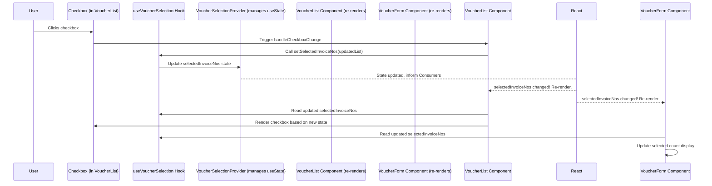

# Chapter 2: Voucher Selection State

Welcome back! In [Chapter 1: Environment Configuration](01_environment_configuration_.md), we learned how our application securely gets its configuration settings from the environment. That's essential for connecting to databases and external services. Now, let's shift our focus to data that changes *while* a user is interacting with the application – specifically, how we keep track of which items a user has chosen from a list.

## The Problem: Keeping Track of Selections

Imagine you're looking at a long list of vouchers in the `merged-tally-helper` app. You want to select a few specific vouchers to export them to Excel or push them to Tally.

You see checkboxes next to each voucher in a table. When you click a checkbox, the application needs to remember that this voucher is now "selected". When you click another checkbox, it needs to add *that* voucher to the list of selected ones. And when you click a button like "Export to Excel", the application needs to know *which* vouchers from the entire list are currently selected so it can process only those.

Where does this list of "currently selected vouchers" live? The table component needs to know it to show which checkboxes are checked. The "Export" or "Submit" button component needs to know it to decide what data to send. These are often different parts of the application interface. If we just stored this information inside the table component itself, the buttons wouldn't be able to access it easily. Passing it up and down through many component levels (called "prop drilling") can get complicated quickly.

We need a way for different parts of the application to share and update this information about which vouchers are selected. This is where **Voucher Selection State** comes in.

## What is Voucher Selection State?

In `merged-tally-helper`, the "Voucher Selection State" is a shared piece of data that keeps track of:

1.  The list of `InvoiceNo` (invoice numbers) for all the vouchers the user has currently selected.
2.  The total sum of the values of these selected vouchers.

Think of it like a **shared clipboard** or a **shopping cart** specifically for vouchers. Any component that needs to know which vouchers are selected can look at this shared clipboard. Any component that needs to change the selection (like clicking a checkbox or a "Select All" button) can update this shared clipboard.

## Sharing Data with React Context

In React applications, **Context** is a powerful feature for sharing data like this across many components without explicitly passing props. It's designed for "global" data or state that needs to be accessible by many components in the application tree.

Imagine Context as a **radio station**.

*   Some component "broadcasts" the data (like the list of selected vouchers) on this station. This is the **Provider**.
*   Any component that needs this data can "tune in" to the station. This is the **Consumer**.

When the data changes at the source (the Provider), all the components that are "tuned in" (Consumers) automatically get the updated data and re-render if needed.

## The `VoucherSelectionContext`

Our project uses React Context to manage the voucher selection state. You'll find the definition of this context in the file `context/VoucherSelectionContext.tsx`.

Let's look at the key parts of this file:

```typescript
// context/VoucherSelectionContext.tsx (Simplified)
"use client"; // This is a Next.js directive for client-side components

import { createContext, useContext, useState, ReactNode } from "react";

// 1. Define the shape (interface) of the data and functions it holds
interface VoucherSelectionContextType {
  selectedInvoiceNos: number[]; // An array of numbers (invoice numbers)
  setSelectedInvoiceNos: (ids: number[]) => void; // A function to update the array
  totalSum: number; // A number for the total sum
  setTotalSum: (amount: number) => void; // A function to update the sum
}

// 2. Create the Context (the "radio station")
const VoucherSelectionContext = createContext<
  VoucherSelectionContextType | undefined
>(undefined); // Start with undefined

// 3. Create the Provider component (the "broadcaster")
export function VoucherSelectionProvider({
  children, // This component will wrap other components
}: {
  children: ReactNode;
}) {
  // Use React's useState to manage the actual data
  const [selectedInvoiceNos, setSelectedInvoiceNos] = useState<number[]>([]);
  const [totalSum, setTotalSum] = useState<number>(0);

  // Provide the state values and update functions to components inside
  return (
    <VoucherSelectionContext.Provider
      value={{
        selectedInvoiceNos,
        setSelectedInvoiceNos,
        totalSum,
        setTotalSum,
      }}
    >
      {children} {/* Render the wrapped components here */}
    </VoucherSelectionContext.Provider>
  );
}

// 4. Create a custom hook to easily consume the Context (the "tuner")
export function useVoucherSelection() {
  const context = useContext(VoucherSelectionContext);
  if (!context) {
    // Throw an error if the hook is used outside the Provider
    throw new Error(
      "useVoucherSelection must be used within a VoucherSelectionProvider"
    );
  }
  return context; // Return the state and update functions
}
```

Let's break this down:

*   **`interface VoucherSelectionContextType`**: This defines the *contract* for our context. It says that anything using this context should expect to find an array of `selectedInvoiceNos` (which are numbers), a function `setSelectedInvoiceNos` to change that array, a `totalSum` number, and a `setTotalSum` function.
*   **`createContext(...)`**: This is the standard React way to create a Context object. We give it the type we defined. The `undefined` is just the default value if a component tries to use the context without being inside a Provider.
*   **`VoucherSelectionProvider` Component**: This component is crucial. It uses React's `useState` hook internally to hold the actual `selectedInvoiceNos` array and the `totalSum` number. The `useState` hook is how React components manage their *own* internal state. The `VoucherSelectionProvider` then takes these state variables and their updater functions and passes them down to *all* components nested inside it via the `value` prop of `VoucherSelectionContext.Provider`.
*   **`useVoucherSelection()` Custom Hook**: This is a common pattern to make using context easier. Instead of calling `useContext(VoucherSelectionContext)` directly everywhere, we create a simple function `useVoucherSelection` that does it for us. This hook also includes a helpful check to make sure it's being used within the `VoucherSelectionProvider`, preventing errors.

## How It's Used in the Project

Let's see how this `VoucherSelectionContext` is used in the actual UI components, like the ones responsible for displaying and acting on vouchers.

### Providing the State

First, the state needs to be made available to the parts of the application that need it. This is done by wrapping the relevant components with the `VoucherSelectionProvider`.

Look at the `app/(root)/india/page.tsx` or `app/(root)/nepal/page.tsx` files:

```typescript
// app/(root)/india/page.tsx (Simplified)
import { VoucherSelectionProvider } from "@/context/VoucherSelectionContext";
// ... other imports

export default function IndiaDashboard() {
  // ... access check
  return (
    // Wrap the main content with the Provider
    <VoucherSelectionProvider>
      <DashboardLayout>
        {/* ... page title and description */}
        <div className="flex justify-end mb-4">
          <Link href="/india/return">
            <Button variant="outline">🔁 Go to Return Invoices</Button>
          </Link>
        </div>
        <VoucherForm /> {/* VoucherForm and VoucherList (inside VoucherForm) are children */}
      </DashboardLayout>
    </VoucherSelectionProvider>
  );
}
```

By wrapping `<DashboardLayout>` (which contains `<VoucherForm>`, which in turn contains `<VoucherList>`) with `<VoucherSelectionProvider>`, we ensure that `VoucherForm` and `VoucherList`, and any components nested inside them, can access the voucher selection state using the `useVoucherSelection` hook.

### Consuming and Updating the State

Now, let's see how components use the state.

1.  **In the Voucher Table (`components/india/VoucherList.tsx`)**:

    This component displays the list of vouchers and includes the checkboxes. It needs to:
    *   Read the `selectedInvoiceNos` array to know which checkboxes should be checked.
    *   Use the `setSelectedInvoiceNos` function when a checkbox is clicked.

    ```typescript
    // components/india/VoucherList.tsx (Simplified)
    "use client";
    import { useVoucherSelection } from "@/context/VoucherSelectionContext";
    // ... other imports

    export default function VoucherList({ vouchers }: VoucherListProps) {
      // Get the selected list and the function to update it from the context
      const { selectedInvoiceNos, setSelectedInvoiceNos } = useVoucherSelection();

      // ... filtering and pagination logic

      // Function called when a single voucher checkbox changes
      const handleCheckboxChange = (invoiceID: number) => {
        const updated = selectedInvoiceNos.includes(invoiceID)
          ? selectedInvoiceNos.filter((id) => id !== invoiceID) // Remove if already selected
          : [...selectedInvoiceNos, invoiceID]; // Add if not selected
        setSelectedInvoiceNos(updated); // Update the shared state!
      };

      // Function called when the "Select All" checkbox changes
      const handleSelectAllChange = () => {
        if (!selectAll) {
          // If not all selected, select all visible/filtered vouchers
          const all = filteredVouchers.map((v) => v.InvoiceNo);
          setSelectedInvoiceNos(all); // Update the shared state!
        } else {
          // If already all selected, clear the selection
          setSelectedInvoiceNos([]); // Update the shared state!
        }
        setSelectAll(!selectAll);
      };

      // ... useEffect to sync "Select All" checkbox with state

      return (
        // ... table rendering
        <TableBody>
          {currentVouchers.map((voucher) => (
            <TableRow key={voucher.InvoiceID}>
              <TableCell>
                {/* Checkbox state depends on selectedInvoiceNos from context */}
                <Checkbox
                  checked={selectedInvoiceNos.includes(voucher.InvoiceNo)}
                  onCheckedChange={() =>
                    handleCheckboxChange(voucher.InvoiceNo) // Calls function that updates context
                  }
                />
              </TableCell>
              {/* ... other cells */}
            </TableRow>
          ))}
        </TableBody>
        // ... pagination
      );
    }
    ```
    When a checkbox is clicked, `handleCheckboxChange` is called. This function checks if the invoice number is already in the `selectedInvoiceNos` array (from the context). If it is, it removes it; otherwise, it adds it. Then, crucially, it calls `setSelectedInvoiceNos(updated)`, which is the function received *from the context*. Calling this function updates the state managed by the `VoucherSelectionProvider`.

2.  **In the Action Form (`components/india/VoucherForm.tsx`)**:

    This component contains the buttons for "Export to Excel" and "Submit to Cloud", and summary cards showing counts. It needs to:
    *   Read the `selectedInvoiceNos` array to know *which* vouchers to export or push.
    *   Read the `selectedInvoiceNos.length` to display the count of selected items.
    *   Read and update `totalSum` (though updating `totalSum` happens implicitly when `selectedInvoiceNos` changes based on the fetched `vouchers` list, the `VoucherForm` component is responsible for setting the *initial* `totalSum` after fetching vouchers).
    *   Use `setSelectedInvoiceNos` to clear the selection after a successful push.

    ```typescript
    // components/india/VoucherForm.tsx (Simplified)
    "use client";
    import { useVoucherSelection } from "@/context/VoucherSelectionContext";
    // ... other imports

    export default function IndiaVoucherForm() {
      // Get the state and updater functions from the context
      const { totalSum, setTotalSum, setSelectedInvoiceNos, selectedInvoiceNos } =
        useVoucherSelection();

      // ... other state (dateRange, vouchers, loading, etc.)

      // Update totalSum when vouchers are fetched
      const handleFetch = async () => {
        // ... fetch logic ...
        setVouchers(sorted);
        setSelectedInvoiceNos([]); // Clear selection after new fetch
        const total = sorted.reduce(
          (sum: number, v: any) => sum + v.FinalRate * v.pax,
          0
        );
        setTotalSum(total); // Set the total sum for ALL fetched vouchers initially
        // ... toast success
      };

      // Export selected vouchers
      const handleExport = () => {
        // Use selectedInvoiceNos from context to filter the voucher list
        const selected = selectedInvoiceNos.length
          ? vouchers.filter((v) => selectedInvoiceNos.includes(v.InvoiceNo))
          : vouchers;
        // ... export logic using 'selected' array
        toast.success("Exported to Excel");
      };

      // Push selected vouchers
      const handlePushToCloud = async () => {
        if (!selectedInvoiceNos.length) { // Check selectedInvoiceNos from context
          toast.error("Select vouchers to push");
          return;
        }
        // ... prepare data using 'vouchers.filter((v) => selectedInvoiceNos.includes(v.InvoiceNo))'
        // ... submit data
        toast.success("Vouchers pushed successfully!");
        setSelectedInvoiceNos([]); // Clear selection after successful push
      };

      return (
        <>
          {/* ... Date inputs and Fetch button */}
          <div className="flex flex-wrap justify-end gap-3">
            <Button
              variant="outline"
              onClick={handleExport} // Calls function that reads context state
              disabled={!vouchers.length}
            >
              Export to Excel
            </Button>
            <Button
              onClick={handlePushToCloud} // Calls function that reads/updates context state
              disabled={pushing || !selectedInvoiceNos.length} // Button disabled based on context state
            >
              {pushing ? "Submitting..." : "Submit to Cloud"}
            </Button>
          </div>

          {/* SUMMARY CARDS - Displaying info from context */}
          <div className="md:col-span-2 grid grid-cols-1 sm:grid-cols-3 gap-4">
            {/* ... Total Fetched card */}
            <Card className="border border-yellow-100 shadow-sm bg-yellow-50">
              <CardHeader>
                <CardTitle className="text-base text-yellow-800">
                  ✅ Selected
                </CardTitle>
              </CardHeader>
              <CardContent className="text-xl font-semibold text-yellow-700">
                {selectedInvoiceNos.length} Selected {/* Reads context state length */}
              </CardContent>
            </Card>
            <Card className="border border-green-100 shadow-sm bg-green-50">
              <CardHeader>
                <CardTitle className="text-base text-green-800">
                  💰 Total Value
                </CardTitle>
              </CardHeader>
              <CardContent className="text-xl font-semibold text-green-700">
                 {/* totalSum is set in handleFetch, derived from fetched vouchers, and is part of the context */}
                ₹ {totalSum.toLocaleString("en-IN")}
              </CardContent>
            </Card>
          </div>

          {/* TABLE */}
          {vouchers.length > 0 && (
            <div className="md:col-span-2 mt-6">
              <VoucherList vouchers={vouchers} /> {/* VoucherList also uses context */}
            </div>
          )}
        </>
      );
    }
    ```
    The `VoucherForm` component accesses `selectedInvoiceNos` to determine which vouchers should be included in the export or push actions. It also displays the count of selected vouchers using `selectedInvoiceNos.length`. After a successful push, it clears the selection by calling `setSelectedInvoiceNos([])`. The `totalSum` is also managed in the context and updated by the form after fetching, allowing the summary card to display it.

## How It Works (Under the Hood)

Let's visualize the flow when a user clicks a checkbox in the `VoucherList` table:



1.  The user clicks a checkbox in a row in the `VoucherList`.
2.  This triggers the `handleCheckboxChange` function inside the `VoucherList` component.
3.  `handleCheckboxChange` calculates the *new* list of selected invoice numbers.
4.  It calls `setSelectedInvoiceNos` (obtained from the `useVoucherSelection` hook). This function call goes back to the `VoucherSelectionProvider`.
5.  The `VoucherSelectionProvider` updates its internal `selectedInvoiceNos` state using React's `useState`.
6.  React detects that the state managed by the Provider has changed. It tells all components that are "subscribed" to this context (using `useVoucherSelection`) that they might need to update.
7.  Both the `VoucherList` and `VoucherForm` components (and any others using `useVoucherSelection` within the Provider) receive the updated `selectedInvoiceNos` value from the hook.
8.  React re-renders these components.
9.  The `VoucherList` re-renders, making sure the clicked checkbox (and potentially the "Select All" checkbox based on its effect) now reflects the new selection state.
10. The `VoucherForm` re-renders, updating the "Selected Count" card to show the new total number of selected vouchers.

This mechanism ensures that clicking a checkbox in one part of the UI (`VoucherList`) immediately and automatically updates related information displayed in another part (`VoucherForm`), without any direct communication needed between the two components. They just communicate via the shared context state.

## Summary of Key Components

| Component/Concept             | Role                                                                 | Where to find it                                       | Analogy          |
| :---------------------------- | :------------------------------------------------------------------- | :----------------------------------------------------- | :--------------- |
| `VoucherSelectionContext`     | The Context object itself; holds the "channel" for the data.         | `context/VoucherSelectionContext.tsx` (created by `createContext`) | The Radio Station |
| `VoucherSelectionProvider`    | Wraps components, manages the actual state (`useState`), and "broadcasts" the data via Context. | `context/VoucherSelectionContext.tsx` (a React Component) | The Broadcaster  |
| `useVoucherSelection` Hook    | A convenient way for any component to "tune in" and access the state and updater functions from the Provider. | `context/VoucherSelectionContext.tsx` (a custom React hook) | The Tuner        |
| Components (e.g., `VoucherList`, `VoucherForm`) | Use `useVoucherSelection` to read the state or call the updater functions. | `components/india/VoucherList.tsx`, `components/india/VoucherForm.tsx`, etc. | The Listeners    |

## Conclusion

In this chapter, we explored the **Voucher Selection State**, understanding its purpose as a shared mechanism to track which vouchers a user has selected. We saw how React Context, specifically the `VoucherSelectionContext`, `VoucherSelectionProvider`, and `useVoucherSelection` hook, provides a clean and efficient way to manage this shared state across different components in the frontend application. This pattern keeps the UI components simpler, as they don't need to manage complex state lifting or prop drilling for selection information.

Now that we understand how the frontend keeps track of user selections, the next logical step is to understand where the list of vouchers actually comes from. In the next chapter, we'll dive into [Database Access](03_database_access_.md).

---
