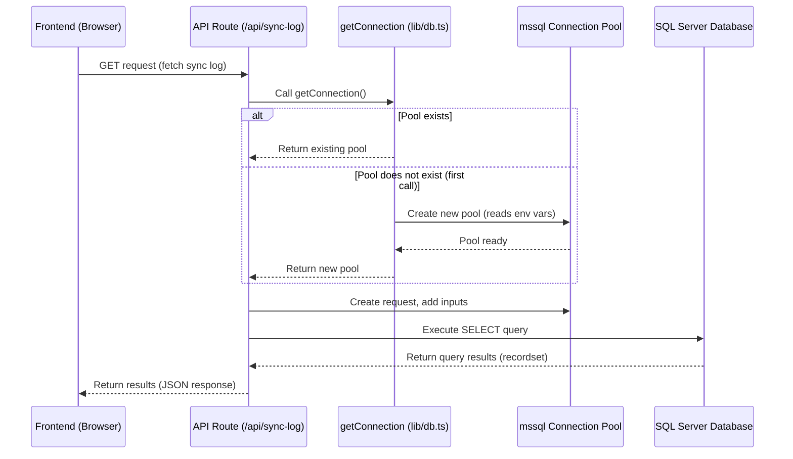

# Chapter 3: Database Access

Welcome back! In [Chapter 1: Environment Configuration](01_environment_configuration_.md), we set up the fundamental way our application gets its secret keys and settings securely. In [Chapter 2: Voucher Selection State](02_voucher_selection_state_.md), we learned how the *frontend* keeps track of which items a user has selected after they've been loaded. But where do those lists of vouchers, user details, or sync history logs *come from* in the first place?

They come from a database!

This chapter is about the part of the `merged-tally-helper` project that knows how to talk to the **Microsoft SQL Server database**. Think of the database as the application's long-term memory or storage room, holding all the important raw data like details about each voucher, information about registered users, and records of past sync operations.

## The Problem: Getting Data from Storage

Our application needs to perform several tasks that require accessing this stored information:

*   When you load the page, it needs to **fetch a list of vouchers** based on a date range so you can see them and select them.
*   When you try to log in, it needs to **check if your username and password are correct** by looking up user details.
*   When you want to see the history of past voucher syncs, it needs to **retrieve those records** from the log.

The core challenge is: how does the application code connect to the database and ask for exactly the information it needs? This requires understanding database connection, sending requests (queries), and receiving results.

## What is Database Access?

Database access in this project refers to the code responsible for:

1.  **Establishing a connection** to the Microsoft SQL Server.
2.  **Sending SQL queries** (commands written in Structured Query Language, the standard language for databases) to request or modify data.
3.  **Receiving and processing the results** returned by the database.

It's like our application has a special assistant whose only job is to communicate with the database's librarian. The assistant handles the technical details of speaking SQL and finding the right books (data).

## Connecting to the Database: The `mssql` Library

Our project uses a Node.js package called `mssql` to interact with the Microsoft SQL Server database. This library provides the necessary tools and functions to establish connections, run queries, and handle responses.

Just like we needed specific ingredients to cook in Chapter 1, `mssql` needs specific details to connect to the database: the server address, database name, username, and password. As we learned in [Chapter 1: Environment Configuration](01_environment_configuration_.md), these sensitive details are stored in environment variables (like `DB_SERVER`, `DB_NAME`, `DB_USER`, `DB_PASSWORD`) and are accessed via `process.env`.

## The Reusable Connection Helper (`lib/db.ts`)

Connecting to a database can be complex, and opening and closing connections frequently is inefficient. A common pattern is to create a **connection pool**, which is a group of ready-to-use database connections. When the application needs to run a query, it gets a connection from the pool, uses it, and then returns it to the pool instead of closing it entirely. This makes accessing the database faster for subsequent requests.

Our project encapsulates this connection logic in a helper function located in `lib/db.ts`.

Here's the simplified code for establishing and reusing the database connection:

```typescript
// lib/db.ts (Simplified)
import sql from "mssql";

const config: sql.config = {
  user: process.env.DB_USER,       // Get from environment variables
  password: process.env.DB_PASSWORD, // Get from environment variables
  database: process.env.DB_NAME,     // Get from environment variables
  server: process.env.DB_SERVER || "localhost", // Get from env, default to localhost
  options: {
    encrypt: true, // Required for Azure SQL DB
    trustServerCertificate: true, // Trust self-signed certs (use with caution)
  },
};

let pool: sql.ConnectionPool; // Variable to hold our connection pool

export async function getConnection() {
  // If the pool doesn't exist yet, create it
  if (!pool) {
    console.log("Creating new database connection pool...");
    // Use the config object to connect
    pool = await sql.connect(config);
    console.log("Database connection pool created.");
  }
  // Return the existing (or newly created) pool
  return pool;
}

// (There might be more code here to handle closing the pool, but we keep it minimal)
```

**Explanation:**

*   We import the `mssql` library.
*   We define a `config` object containing the connection details, pulling values from `process.env`. This is where our setup from [Chapter 1](01_environment_configuration_.md) is used!
*   We declare a variable `pool` of type `sql.ConnectionPool` to hold the connection pool.
*   The `getConnection` function is `async` because connecting takes time.
*   Inside `getConnection`, we check if `pool` already has a value.
*   If `pool` is `undefined` (meaning it's the first time we're connecting), we call `sql.connect(config)` to establish the connection pool and assign it to `pool`.
*   Finally, we return the `pool`.

This function is designed so that no matter how many times you call `getConnection()`, it only creates the connection pool once and then reuses the same pool for all subsequent calls. This is efficient!

## Running SQL Queries

Once you have the connection pool from `getConnection()`, you can use it to send SQL commands to the database. The `mssql` library provides a `pool.request()` method to create a new request object, which you can then use to add input parameters and execute a query.

Here's a simplified example of how you might fetch data, using snippets from the `lib/authOptions.ts` file which fetches user data for authentication:

```typescript
// lib/authOptions.ts (Simplified snippet)
import { getConnection } from "@/lib/db"; // Import our connection helper

// ... inside the authorize function ...

  async authorize(credentials) {
    if (!credentials) return null;

    // Get the database connection pool using our helper function
    const pool = await getConnection();

    // Create a new request object
    const request = pool.request();

    // Add input parameters (prevents SQL injection!)
    request.input("username", credentials.username);
    request.input("password", credentials.password);

    // Execute the SQL query
    const result = await request.query(
      "SELECT * FROM TallyUsers WHERE username = @username AND password = @password"
    );

    // The result.recordset contains the rows returned by the database
    const user = result.recordset[0];

    if (user) {
      // Found the user!
      return {
        id: String(user.id),
        name: user.username,
        region: user.region,
      };
    }
    return null; // User not found or credentials incorrect
  }
// ... rest of the authOptions file ...
```

**Explanation:**

*   We call `await getConnection()` to get the connection pool.
*   We call `pool.request()` to prepare a new request to the database.
*   `request.input("username", credentials.username)` is crucial! This adds parameters to the query safely. Instead of directly putting the username and password strings into the SQL query (which is dangerous and can lead to SQL injection attacks), we use placeholders (`@username`, `@password` in SQL Server) and provide the values separately. The `mssql` library handles combining them safely.
*   `await request.query("...")` executes the SQL command. This is where we tell the database what data we want (`SELECT * FROM TallyUsers...`).
*   The result object contains the data returned by the database. `result.recordset` is an array of rows that matched our query.

This pattern of `getConnection()`, `pool.request().input(...).query(...)` is used whenever the application needs to read from or write to the database.

## How It Works (Under the Hood)

Let's trace a simple interaction, like fetching a sync log using the provided `/api/sync-log` route:



1.  The frontend (e.g., the code in `components/india/VoucherForm.tsx` or similar) makes a request to a backend API route to get data.
2.  The API route handler (like the `GET` function in `app/api/sync-log/route.ts`) is executed on the server.
3.  The API route calls `await getConnection()`.
4.  `getConnection` checks if the database connection pool already exists. If not, it creates one using the configuration from environment variables ([Chapter 1](01_environment_configuration_.md)) and waits for it to be ready. If it exists, it returns the existing pool immediately.
5.  The API route gets the pool and uses `pool.request()` to prepare a query. It adds any necessary parameters (like `region` and `voucher_type` for the sync log) using `.input()`.
6.  The API route calls `request.query()` with the SQL command. The `mssql` library sends this command to the actual SQL Server database.
7.  The database executes the query, finds the requested data (e.g., the latest sync log entry), and sends the results back to the application via the `mssql` connection pool.
8.  The `await request.query()` call completes, and the API route receives the data in the `result.recordset`.
9.  The API route processes the data (e.g., formats it as JSON) and sends it back as the response to the frontend.
10. The frontend receives the data and uses it to update the user interface (e.g., display the last sync date).

This flow shows how the frontend triggers a data request, the server-side code handles the database interaction using the reusable `getConnection` function, and the data is returned to complete the user's request.

## Other Examples of Database Use

The same `getConnection` and query pattern is used in other parts of the backend:

*   **Authentication (`lib/authOptions.ts`):** As shown earlier, it fetches user details from the `TallyUsers` table based on provided credentials.
*   **Sync Log Saving (`app/api/sync-log/route.ts` POST):** When a successful sync occurs, the application needs to record it. The POST handler in this file uses `getConnection` and then executes `INSERT` or `UPDATE` queries to save the sync details in the `TallyVoucherSyncLog` table.

Here's a snippet of the POST handler for saving sync logs:

```typescript
// app/api/sync-log/route.ts (Simplified POST snippet)
import { getConnection } from "@/lib/db"; // Use the connection helper

export async function POST(req: NextRequest) {
  // ... get user session and request body ...

  const pool = await getConnection(); // Get the database connection pool

  // Check if log exists (SELECT query)
  const existingLog = await pool
    .request()
    .input("region", region)
    .input("voucher_type", voucher_type).query(`
      SELECT COUNT(*) as count
      FROM TallyVoucherSyncLog
      WHERE region = @region AND voucher_type = @voucher_type
    `);

  const logExists = existingLog.recordset[0].count > 0;

  if (logExists) {
    // Update existing log (UPDATE query)
    await pool
      .request()
      .input("region", region)
      // ... add other inputs ...
      .query(`
        UPDATE TallyVoucherSyncLog
        SET
        ... -- set fields here
        WHERE region = @region AND voucher_type = @voucher_type
      `);
  } else {
    // Insert new log (INSERT query)
    await pool
      .request()
      .input("user_id", parseInt(user_id))
      // ... add other inputs ...
      .query(`
        INSERT INTO TallyVoucherSyncLog
        (...)
        VALUES (...)
      `);
  }

  // ... return success or error response
}
```

This again follows the pattern: get the connection, create a request, add inputs, and execute a query (either `SELECT`, `UPDATE`, or `INSERT` in this case).

## Summary of Key Components

| Component          | Role                                                          | Where to find it        | Analogy                   |
| :----------------- | :------------------------------------------------------------ | :---------------------- | :------------------------ |
| `lib/db.ts`        | Manages the database connection pool and provides `getConnection`. | `lib/db.ts`             | The Connection Manager    |
| `mssql` library    | The technical tool for connecting and running SQL commands.     | `package.json` (`mssql` dependency) | The Language Translator   |
| SQL Queries (`SELECT`, `INSERT`, `UPDATE`) | The commands sent to the database to interact with data. | Inside `query()` calls  | The Specific Request Form |
| `pool.request().input(...).query(...)` | The pattern used to prepare and execute a database command safely. | Used in API routes, auth logic | The Request Handler Flow  |
| Environment Variables (`DB_...`) | Securely store database credentials.                      | `.env.local`, `process.env` ([Chapter 1](01_environment_configuration_.md)) | The Secret Address Book |

## Conclusion

In this chapter, you learned how the `merged-tally-helper` project accesses its persistent data storage: the Microsoft SQL Server database. You saw how the `mssql` library is used, how environment variables configure the connection ([Chapter 1](01_environment_configuration_.md)), and how the `lib/db.ts` file provides a reusable and efficient way to manage database connections via a connection pool. You also learned the basic pattern for executing SQL queries using `pool.request()` and `request.input()`.

Understanding database access is fundamental, as this is where the application gets the raw data it needs to function. Often, before an application can fetch specific data for a user, it needs to know who that user is. In the next chapter, we'll explore the [Authentication System](04_authentication_system_.md), which handles verifying user identity.

---
