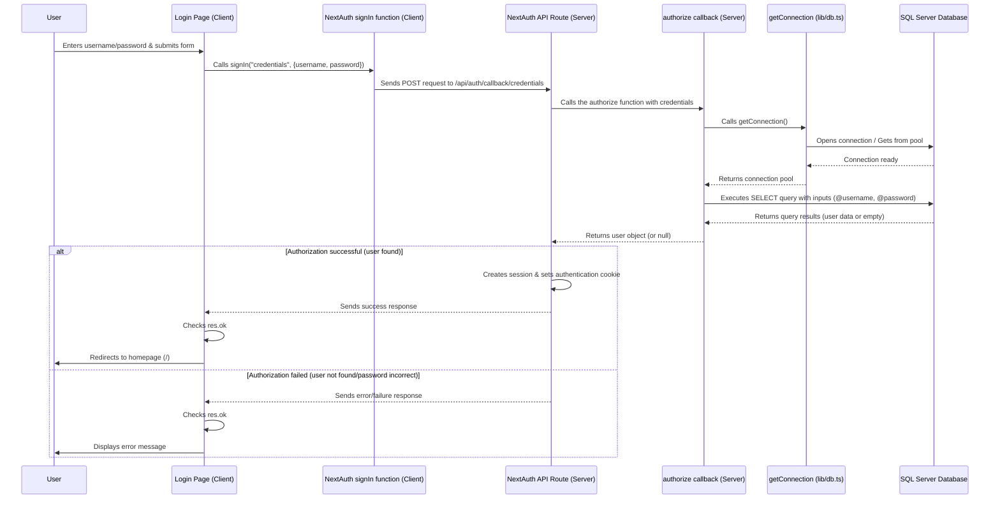

# Chapter 4: Authentication System

Welcome back! In the last chapter, [Chapter 3: Database Access](03_database_access_.md), we learned how our application connects to the database to fetch and save important information like voucher details and sync history. But before the application serves up sensitive data from the database or performs actions, it needs to answer a crucial question: **Who are you?**

This is where the **Authentication System** comes in.

## The Problem: Knowing Who is Using the App

Imagine the `merged-tally-helper` is like a secure building. It holds valuable records (the database) and provides specific services (like syncing vouchers). You don't want just *anyone* walking in and accessing everything. You need a way to:

1.  **Verify Identity:** Check that the person trying to enter is a recognized user.
2.  **Remember Identity:** Once they're inside, the building needs to remember who they are so they don't have to show their ID every single time they move to a different room or service.
3.  **Understand Permissions:** Know *what* rooms or services that specific person is allowed to access. In our application, this includes knowing which region (India, Nepal, or All) they belong to, as this impacts what data they see and interact with.

Putting sensitive data on display or allowing actions without knowing *who* is performing them is a major security risk. We need a robust system to handle user logins and manage their identity throughout their session.

## What is the Authentication System?

In the `merged-tally-helper` project, the Authentication System is the set of code and configurations responsible for:

*   **User Login:** Handling the process when a user enters their username and password.
*   **Identity Verification:** Checking the provided credentials against the user information stored in the database ([Chapter 3: Database Access](03_database_access_.md)).
*   **Session Management:** Keeping the user logged in and remembering who they are as they navigate different pages.
*   **Attaching User Info:** Making the user's identity and relevant details (like their region) available to different parts of the application (both server-side and client-side).

It's like the **security guard at the entrance** who checks your ID (authentication) and then gives you a temporary pass (session) that identifies you inside the building, potentially indicating which floors or departments you have access to (part of authorization, covered more in [Chapter 9: Regional Routing & Access Control](09_regional_routing___access_control_.md)).

## Using NextAuth.js

This project uses a popular library for Next.js applications called **NextAuth.js** (often just called Auth.js now) to handle the complexities of authentication.

Why use a library like NextAuth.js?
*   It simplifies common authentication flows (like username/password login).
*   It handles secure session management automatically.
*   It provides helpful functions and components to access session data in your React components.
*   It reduces the amount of security-sensitive code you have to write yourself.

NextAuth.js needs to know *how* to verify users. In our case, it needs to know how to take a username and password and check if they match an entry in our SQL Server database. This is done using a **Credentials Provider**.

## The Credentials Provider and Database Check

A Credentials Provider in NextAuth.js is configured to accept arbitrary credentials (like username and password) and then run a custom `authorize` function. This function is where *our* logic lives to check those credentials against *our* user data source (the database).

Let's look at the core configuration in `lib/authOptions.ts`:

```typescript
// lib/authOptions.ts (Simplified)
import { NextAuthOptions } from "next-auth";
import CredentialsProvider from "next-auth/providers/credentials";
import { getConnection } from "@/lib/db"; // Our database helper

export const authOptions: NextAuthOptions = {
  providers: [
    // Configure the Credentials provider
    CredentialsProvider({
      name: "Credentials", // Display name on the login form
      credentials: {
        // Define the fields the provider expects
        username: { label: "Username", type: "text" },
        password: { label: "Password", type: "password" },
      },
      // This is the function where we check credentials!
      async authorize(credentials) {
        if (!credentials) return null; // No credentials provided

        // Use our database helper to get a connection
        const pool = await getConnection();

        // Prepare and execute the SQL query to find the user
        const result = await pool
          .request()
          .input("username", credentials.username) // Pass username safely
          .input("password", credentials.password) // Pass password safely
          .query(
            "SELECT id, username, region FROM TallyUsers WHERE username = @username AND password = @password"
          ); // SQL query

        const user = result.recordset[0]; // Get the first row if found

        if (user) {
          // If user is found in the database...
          return {
            id: String(user.id), // NextAuth requires id to be a string
            name: user.username,
            region: user.region, // Include the region from the database!
          };
        }
        // If user is not found or password doesn't match
        return null;
      },
    }),
    // ... other providers could go here (like Google, etc.)
  ],
  // ... other NextAuth options below
};
```

**Explanation:**

*   We define `authOptions`, an object that holds all the configuration for NextAuth.
*   Inside `providers`, we add a `CredentialsProvider`.
*   `credentials` defines what input fields NextAuth should expect (username and password).
*   The `authorize` function is the core logic. NextAuth calls this function when someone tries to log in with username/password.
*   It receives the `credentials` entered by the user.
*   It uses `await getConnection()` from our database helper ([Chapter 3](03_database_access_.md)) to get a connection.
*   It runs a SQL query (`SELECT ... FROM TallyUsers WHERE ...`) using `pool.request().input(...).query(...)` ([Chapter 3](03_database_access_.md)) to check if a user exists with the matching username AND password.
*   If a user is found (`result.recordset[0]` exists), it returns a user object to NextAuth. **Crucially**, this object includes the `id`, `name` (username), and the `region` property fetched from the database.
*   If no user is found with those credentials, it returns `null`. Returning `null` tells NextAuth that the login failed.

This `authorize` function is the bridge between NextAuth's login flow and our application's database of users.

## Integrating NextAuth with Next.js

NextAuth needs to know where to handle authentication requests (like submitting the login form). In Next.js App Router, this is typically done via a dynamic route handler at `app/api/auth/[...nextauth]/route.ts`.

This file is very simple:

```typescript
// app/api/auth/[...nextauth]/route.ts
import NextAuth from "next-auth";
import { authOptions } from "@/lib/authOptions"; // Import our configuration

// Create the NextAuth handler using our options
const handler = NextAuth(authOptions);

// Export the handler for GET and POST requests
export { handler as GET, handler as POST };
```

**Explanation:**

*   It imports the `authOptions` we just looked at.
*   It creates a `handler` function by passing `authOptions` to `NextAuth()`.
*   It exports this `handler` to respond to both `GET` and `POST` requests made to the `/api/auth/...` URL. NextAuth handles the specific paths internally (like `/api/auth/signin`, `/api/auth/callback`, etc.).

## The Login Page (`app/(auth)/login/page.tsx`)

The frontend part of the login process is handled by the login page component.

```typescript
// app/(auth)/login/page.tsx (Simplified)
"use client"; // This page is a client component

import { signIn } from "next-auth/react"; // Import the signIn function
import { useState } from "react";
import { useRouter } from "next/navigation"; // Hook for navigation

export default function LoginPage() {
  const router = useRouter();
  const [username, setUsername] = useState("");
  const [password, setPassword] = useState("");
  const [error, setError] = useState(""); // State to show login errors

  const handleSubmit = async (e: React.FormEvent) => {
    e.preventDefault();
    setError(""); // Clear previous errors

    // Call NextAuth's signIn function
    const res = await signIn("credentials", {
      username, // Pass the entered username
      password, // Pass the entered password
      redirect: false, // Don't let NextAuth redirect, we'll do it manually
    });

    if (res?.ok) {
      // If signIn was successful (returned a user in authorize)
      router.push("/"); // Redirect to the homepage
    } else {
      // If signIn failed (authorize returned null)
      setError("Invalid credentials. Please try again."); // Show error message
    }
  };

  return (
    <div className="min-h-screen grid ...">
      {/* ... Login Form UI ... */}
      <form onSubmit={handleSubmit} className="space-y-5">
        {/* ... Username and Password input fields ... */}
        <div>
          <label className="block mb-1 font-medium text-gray-700">Username</label>
          <input
            type="text"
            value={username}
            onChange={(e) => setUsername(e.target.value)}
            className="w-full border ..."
            required
          />
        </div>
        <div>
          <label className="block mb-1 font-medium text-gray-700">Password</label>
          <input
            type="password"
            value={password}
            onChange={(e) => setPassword(e.target.value)}
            className="w-full border ..."
            required
          />
        </div>

        {error && <p className="text-red-500 text-sm">{error}</p>} {/* Display error */}

        <button
          type="submit"
          className="w-full bg-blue-600 ..."
        >
          Sign In
        </button>
      </form>
    </div>
  );
}
```

**Explanation:**

*   This is a client component (`"use client"`).
*   It uses standard React state (`useState`) to manage the entered username and password.
*   When the form is submitted, `handleSubmit` is called.
*   Inside `handleSubmit`, it calls `signIn("credentials", { ... })`.
    *   The first argument `"credentials"` tells NextAuth to use the Credentials Provider we configured.
    *   The second argument is an object containing the `username` and `password` that NextAuth will pass to our `authorize` function in `authOptions`.
    *   `redirect: false` tells NextAuth *not* to automatically redirect after login success/failure. We want to handle the redirect ourselves based on the result (`res?.ok`).
*   If `res?.ok` is true (meaning `authorize` returned a user object), we use `router.push("/")` to send the user to the main dashboard page.
*   If `res?.ok` is false, we display an error message.

## Sessions and User Information

Once a user successfully logs in, NextAuth establishes a session. This typically involves setting a secure cookie in the user's browser. For subsequent requests, NextAuth uses this cookie to identify the user without requiring them to log in again.

NextAuth also allows you to customize the information stored in the session. Remember how our `authorize` function returned a user object including the `region`? We need to make sure this `region` makes it into the session object that our frontend components can access.

This is handled by the `callbacks` in `authOptions`:

```typescript
// lib/authOptions.ts (Simplified - Callbacks)
import { NextAuthOptions } from "next-auth";
// ... other imports and providers ...

export const authOptions: NextAuthOptions = {
  // ... providers ...
  callbacks: {
    // This callback runs when a JWT (JSON Web Token) is created or updated
    async jwt({ token, user }) {
      // If 'user' object is available (happens after a successful login via authorize)
      if (user) {
        token.id = user.id; // Add user id to the token
        token.region = (user as any).region; // Add the custom 'region' from our user object to the token
      }
      return token; // Return the updated token
    },
    // This callback runs whenever a session is checked
    async session({ session, token }) {
      // If token and session.user exist
      if (token && session.user) {
        session.user.id = token.id as string; // Add id from token to session.user
        session.user.region = token.region as string; // Add region from token to session.user
      }
      return session; // Return the updated session object
    },
  },
  // ... secret, pages ...
  secret: process.env.NEXTAUTH_SECRET, // Secret from Environment Variables (Chapter 1)
  pages: {
    signIn: "/login", // Tell NextAuth where our custom login page is
  },
};
```

**Explanation:**

*   **`jwt` callback:** This callback receives the `token` and the `user` object (if provided, like after a successful `authorize` call). We take the `id` and `region` from our custom `user` object and add them to the `token`. This token is stored securely (often encrypted in the cookie).
*   **`session` callback:** This callback runs whenever a session object needs to be created for a client component. It receives the `session` object and the decrypted `token`. We take the `id` and `region` from the `token` and add them to the `session.user` object.

After these callbacks run, any component that accesses the session will find `session.user.id` and `session.user.region`.

**Important Note on Types:** Since `region` is a custom property, we need to tell TypeScript about it. The file `types/next-auth.d.ts` does this:

```typescript
// types/next-auth.d.ts
import NextAuth from "next-auth";

declare module "next-auth" {
  // Extend the default Session interface
  interface Session {
    user: {
      id: string; // Add id
      name?: string | null;
      email?: string | null;
      image?: string | null;
      region?: string; // Add custom region property
    };
  }

  // Extend the default User interface (used in the authorize callback)
  interface User {
    id: string;
    region?: string; // Add custom region property
  }
}

declare module "next-auth/jwt" {
  // Extend the default JWT interface (used in jwt callback)
  interface JWT {
    id: string; // Add id
    region?: string; // Add custom region property
  }
}
```

This file modifies the type definitions for NextAuth, so when you write code accessing `session.user.region`, TypeScript understands it's a valid property.

## Accessing Session Data in Components

Now that the user is logged in and the session object contains their `id` and `region`, how do we use this information in our components?

NextAuth provides hooks and functions for this:

1.  **`getServerSession` (Server Components):** Use this inside `async` Server Components (like pages or layouts) to get the session *before* rendering. This is great for server-side checks or fetching data based on the user.
2.  **`useSession` (Client Components):** Use this hook inside client components (`"use client"`) to access the session data reactively. When the session changes (e.g., user logs out), components using this hook will re-render.

First, for `useSession` to work in client components, we need to wrap parts of our application in a `SessionProvider`. This is done in `components/ClientSessionProvider.tsx`:

```typescript
// components/ClientSessionProvider.tsx
"use client"; // This component is a client component

import { SessionProvider } from "next-auth/react"; // Import the provider
import { Session } from "next-auth"; // Import the Session type

export default function ClientSessionProvider({
  children,
  session, // The initial session passed from the server
}: {
  children: React.ReactNode;
  session: Session | null;
}) {
  // Wrap children with SessionProvider, passing the initial session
  return <SessionProvider session={session}>{children}</SessionProvider>;
}
```

This provider receives the initial session from the server (using `getServerSession` in the root layout) and makes it available to all nested client components via the `useSession` hook.

This `ClientSessionProvider` is then used in the main application layout (`app/(root)/layout.tsx`):

```typescript
// app/(root)/layout.tsx (Simplified)
import { getServerSession } from "next-auth"; // Server-side function to get session
import { redirect } from "next/navigation"; // Function to redirect
import ClientSessionProvider from "@/components/ClientSessionProvider"; // Our provider
import { authOptions } from "@/lib/authOptions"; // Our auth configuration

export default async function RootLayout({
  children,
}: Readonly<{
  children: React.ReactNode;
}>) {
  // Get the session BEFORE rendering the layout
  const session = await getServerSession(authOptions);

  // If no session exists (user not logged in), redirect them to the login page
  if (!session) {
    redirect("/login");
  }

  return (
    <html lang="en">
      <body>
        {/* Wrap the main content with the ClientSessionProvider */}
        <ClientSessionProvider session={session}>
          {/* ... Toaster component */}
          {children} {/* The actual page content goes here */}
        </ClientSessionProvider>
      </body>
    </html>
  );
}
```

**Explanation:**

*   The `RootLayout` is an `async` server component.
*   It uses `await getServerSession(authOptions)` to check the session on the server side for every request to a page within the `/(root)` group (which requires authentication).
*   If `session` is `null` (no authenticated user), it uses `redirect("/login")` to send the user back to the login page. This is a simple form of server-side access control.
*   If a session exists, it passes the `session` object down to the `ClientSessionProvider`, making the session available to client components like `useSession`.

Finally, client pages or components can use `useSession` to read the logged-in user's information, including their region:

```typescript
// app/(root)/india/page.tsx (Simplified)
"use client"; // This page is a client component

import { useSession } from "next-auth/react"; // Import the hook
// ... other imports

export default function IndiaDashboard() {
  // Get the session data using the hook
  const { data } = useSession();

  // Check the user's region from the session data!
  if (data?.user?.region !== "india") {
    // If the region doesn't match, show an access denied message
    return (
      <div className="flex flex-col items-center justify-center h-screen">
        <h1 className="text-2xl font-bold mb-2">Access Denied</h1>
        <p className="text-gray-600 mb-4">
          You do not have access to this page.
        </p>
        {/* ... Link to Home */}
      </div>
    );
  }

  // If the region matches, render the actual dashboard content
  return (
    // ... Dashboard content wrapped in VoucherSelectionProvider (Chapter 2) ...
    <VoucherSelectionProvider>
      <DashboardLayout>
        <h1 className="text-2xl font-bold text-center">Welcome, India Admin 🇮🇳</h1>
        {/* ... rest of the page ... */}
        <VoucherForm />
      </DashboardLayout>
    </VoucherSelectionProvider>
  );
}
```

**Explanation:**

*   This component is client-side (`"use client"`).
*   It uses `useSession()` to get the session data. The hook returns an object with `data` (the session object itself), `status` (loading, authenticated, unauthenticated), and `update` (function to update session).
*   It accesses `data?.user?.region` to check the user's assigned region.
*   Based on the region, it either renders an "Access Denied" message or the actual dashboard content for that region.

This demonstrates how the `region` data, originally fetched from the database during login, is carried through the session and used on the frontend for basic regional access control. More comprehensive access control and routing based on region are discussed in [Chapter 9: Regional Routing & Access Control](09_regional_routing___access_control_.md).

## How It Works (Under the Hood - Login Flow)

Let's visualize the journey of a user logging in:



1.  The user enters their credentials on the Login Page and submits the form.
2.  The Login Page component uses the `signIn` function provided by `next-auth/react`.
3.  `signIn` sends a request to the special NextAuth API route on the server (`/api/auth/callback/credentials`).
4.  The NextAuth API route receives the request and calls the `authorize` function that we defined in our `authOptions`.
5.  Our `authorize` function gets a database connection using `getConnection` ([Chapter 3](03_database_access_.md)).
6.  It executes a SQL query on the database to verify the username and password against the `TallyUsers` table.
7.  The database returns the result (either the user's row or no row).
8.  `authorize` returns a user object (including `id` and `region`) if found, or `null` if not.
9.  Back in the NextAuth API route:
    *   If `authorize` returned a user, NextAuth knows the user is authenticated. It creates a session and sets a secure HTTP-only cookie in the user's browser.
    *   If `authorize` returned `null`, NextAuth knows authentication failed.
10. NextAuth sends a response back to the Login Page component.
11. The Login Page component checks the response (`res?.ok`) and either redirects the user to the main page (`/`) or displays an error message.

Once the cookie is set, subsequent requests from the user's browser to pages under the `/` route will include this cookie. The `getServerSession` or `useSession` functions can then use this cookie (via the backend handling it) to retrieve the user's session information, including their `region`, without hitting the database again for every page load.

## Summary of Key Components

| Component/Concept                  | Role                                                                       | Where to find it                                     | Analogy                       |
| :--------------------------------- | :------------------------------------------------------------------------- | :--------------------------------------------------- | :---------------------------- |
| NextAuth.js                        | The library handling the overall authentication flow and session management. | `package.json` (`next-auth` dependency)              | The Security System Framework |
| `authOptions` (`lib/authOptions.ts`) | The main configuration for NextAuth, specifying how to authenticate.     | `lib/authOptions.ts`                                 | The Security Policy           |
| Credentials Provider               | Tells NextAuth to use username/password, hooking into our custom logic.  | Inside `authOptions.providers`                       | The ID Card Reader            |
| `authorize` function               | Contains the specific code to check credentials against the database.      | Inside the Credentials Provider configuration        | The ID Verification Logic     |
| `app/api/auth/[...nextauth]/route.ts` | The API route that receives authentication requests from the frontend.     | `app/api/auth/[...nextauth]/route.ts`                | The Security Checkpoint URL   |
| `signIn` function (`next-auth/react`) | Frontend function to initiate the login process by sending credentials.    | Used in `app/(auth)/login/page.tsx`                 | The "Attempt to Enter" Button |
| `useSession` hook (`next-auth/react`) | Frontend hook (client-side) to access logged-in user/session data.       | Used in client components (e.g., dashboard pages)    | The "Check My Access Pass" Hook |
| `getServerSession` (`next-auth`)   | Server-side function to access logged-in user/session data.                | Used in Server Components (e.g., `app/(root)/layout.tsx`) | The Server-Side ID Check      |
| `callbacks.jwt`, `callbacks.session` | Functions to transfer custom user data (like region) into the session object. | Inside `authOptions.callbacks`                       | The "Annotate My Access Pass" Rules |
| `types/next-auth.d.ts`             | Tells TypeScript about custom session properties like `region`.            | `types/next-auth.d.ts`                               | The Custom ID Pass Definition |
| `ClientSessionProvider`            | Wraps components to make `useSession` available on the client side.        | `components/ClientSessionProvider.tsx`               | The Access Pass Distribution Booth |

## Conclusion

In this chapter, you learned how the `merged-tally-helper` project implements its **Authentication System** using NextAuth.js. You saw how the Credentials Provider hooks into our database access logic ([Chapter 3: Database Access](03_database_access_.md)) via the `authorize` function to verify user credentials. You also understood how sessions are managed and how user information, including the crucial `region` property, is stored in the session using callbacks and custom type definitions. Finally, you saw how frontend components use `signIn`, `useSession`, and `getServerSession` to handle the login flow and access user data for basic access control.

Knowing who the user is and what region they belong to is essential for the rest of the application. This authenticated identity will often be needed when interacting with external systems or fetching user-specific data. In the next chapter, we will explore [External API Integration](05_external_api_integration_.md), which handles communication with services outside our application.

---