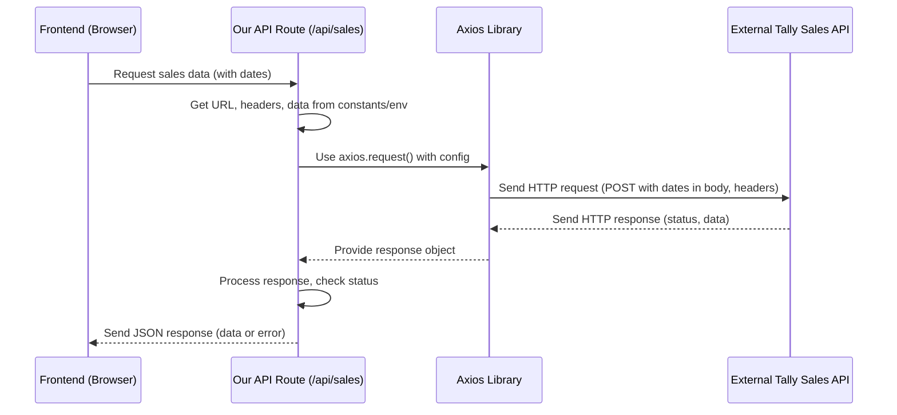
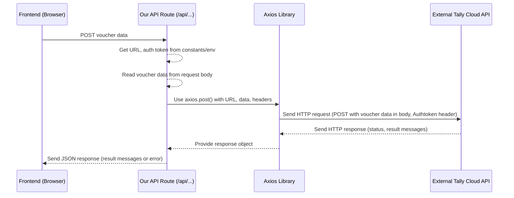

# Chapter 5: External API Integration

Welcome back! In the last chapter, [Chapter 4: Authentication System](04_authentication_system_.md), we learned how `merged-tally-helper` knows *who* is using the application by verifying their identity and managing their session. Knowing who the user is is crucial, but often, the application needs to interact with systems *outside* itself to get the data it needs or send processed data.

Imagine our application is like a busy office. We've got the security guard ([Chapter 4](04_authentication_system_.md)) checking IDs, and librarians ([Chapter 3: Database Access](03_database_access_.md)) managing our internal records. But sometimes, the office needs to send important documents to other offices (like Tally Cloud services) or get reports from them (like raw sales data from a source Tally system).

This is where **External API Integration** comes in. It's the system that handles sending messages back and forth between our application and these external Tally systems over the internet.

## The Problem: Talking to Other Computers

Our `merged-tally-helper` application isn't an island. Its main job is to take data from one place (a Tally API providing sales entries) and send it to other places (different Tally Cloud APIs for India Sales, India Return, Nepal Sales, Nepal Purchase).

To do this, our application needs to know how to:

1.  **Request Data:** Ask the source Tally API for the sales entries within a specific date range.
2.  **Send Data:** Take the processed voucher information and deliver it securely to the correct destination Tally Cloud API.
3.  **Handle Communication:** Speak the language of the internet (HTTP requests) and deal with things like URLs, security headers, and waiting for responses.

We need a reliable way to make these requests and handle the responses from external servers.

## What is External API Integration?

In this project, **External API Integration** is the part of the application responsible for communicating with web services (APIs) that are running *outside* our own server. This communication happens using the standard **HTTP protocol**, which is how web browsers and servers talk to each other over the internet.

Think of it as the application's **messenger service**. It prepares the message (the request), finds the address (the API URL), adds any necessary identification or instructions (headers and data), sends it out, waits for the reply (the response), and brings it back to the application.

The primary tool used in this project for sending these HTTP requests is the `axios` library.

## Making HTTP Requests with Axios

`axios` is a popular JavaScript library specifically designed for making HTTP requests from either web browsers or Node.js applications. It simplifies the process compared to using the built-in browser or Node.js features.

`axios` allows us to easily make different types of requests, like:

*   `GET`: Used to *request* or *fetch* data from a server (like getting sales entries).
*   `POST`: Used to *send* data to a server to create or update a resource (like sending voucher data to a Tally Cloud API).

## Securing API Details: Environment Variables

Just like database credentials or authentication secrets ([Chapter 1: Environment Configuration](01_environment_configuration_.md)), the URLs and authorization tokens for external APIs are sensitive and environment-specific. They are loaded from environment variables.

The file `constants/index.ts` loads these values using `process.env`:

```typescript
// constants/index.ts (Relevant parts)
const salesURL = process.env.SALES_URL || ""; // URL for fetching sales data
const authorization = process.env.URL_AUTHORIZATION || ""; // Auth header for sales API
const cookie = process.env.URL_COOKIE || ""; // Cookie header for sales API

// URLs and tokens for pushing data to various cloud APIs
const cloudURL = process.env.CLOUD_URL || ""; // India Sales Cloud URL
const cloudAuthToken = process.env.CLOUD_AUTH_TOKEN || ""; // India Sales Token

const returnCloudURL = process.env.RETURN_CLOUD_URL || ""; // India Return Cloud URL
const returnCloudAuthToken = process.env.RETURN_CLOUD_AUTH_TOKEN || ""; // India Return Token

// Nepal Sale
const saleCloudURL = process.env.NEPAL_SALE_CLOUD_URL || ""; // Nepal Sale Cloud URL
const saleCloudAuthToken = process.env.NEPAL_SALE_CLOUD_AUTH_TOKEN || ""; // Nepal Sale Token

// Nepal Purchase
const purchaseCloudURL = process.env.NEPAL_PURCHASE_CLOUD_URL || ""; // Nepal Purchase Cloud URL
const purchaseCloudAuthToken = process.env.NEPAL_PURCHASE_CLOUD_AUTH_TOKEN || ""; // Nepal Purchase Token


export {
  salesURL,
  authorization,
  cookie,
  cloudURL,
  cloudAuthToken,
  returnCloudURL,
  returnCloudAuthToken,
  saleCloudURL,
  saleCloudAuthToken,
  purchaseCloudAuthToken,
  purchaseCloudURL,
};
```

These variables are defined in your `.env.local` file ([Chapter 1](01_environment_configuration_.md)), keeping the actual URLs and tokens out of the code itself.

## Use Case 1: Fetching Sales Data

The application needs to fetch sales data from a specific Tally API. This is handled by the API route located at `app/api/sales/route.ts`.

Here's a simplified look at the `GET` function in this file:

```typescript
// app/api/sales/route.ts (Simplified GET function)
import axios from "axios";
import { NextResponse } from "next/server";
import { getServerSession } from "next-auth"; // To check if the user is logged in

import { salesURL, authorization, cookie } from "@/constants"; // Get API details

export async function GET(request: Request) {
  try {
    // 1. Check if the user is authenticated (uses logic from Chapter 4)
    const session = await getServerSession(authOptions);
    if (!session?.user?.id) {
      return NextResponse.json({ error: "Unauthorized" }, { status: 401 });
    }

    // 2. Get date range from the request URL
    const { searchParams } = new URL(request.url);
    const startDate = searchParams.get("startDate");
    const endDate = searchParams.get("endDate");

    // 3. Prepare the request configuration for Axios
    const config = {
      method: "post", // The external API might expect a POST even for fetching
      url: salesURL, // The URL from constants/environment variables
      headers: {
        "Content-Type": "application/json",
        Authorization: authorization, // Auth token from constants/environment variables
        Cookie: cookie, // Cookie from constants/environment variables
      },
      data: {
        // Data to send in the request body (date range)
        from_date: startDate?.replace(/-/g, "/"),
        to_date: endDate?.replace(/-/g, "/"),
      },
    };

    // 4. Make the HTTP request using Axios and wait for the response
    const response = await axios.request(config);

    // 5. Handle the response
    if (response.status !== 200) {
      // If the external API returned an error status
      return NextResponse.json(
        { error: "Failed to fetch sales entries" },
        { status: response.status }
      );
    }

    // 6. Return the data received from the external API
    return NextResponse.json(response.data);

  } catch (error) {
    // Handle any errors during the process
    console.error("Error fetching data:", error);
    return NextResponse.json(
      { error: "Failed to fetch sales entries" },
      { status: 500 }
    );
  }
}
```

**Explanation:**

*   This code runs on the **server** (it's an API route). This is important because we don't want to expose the `Authorization` and `Cookie` headers directly in the user's browser.
*   It first checks if a user is logged in using `getServerSession` ([Chapter 4: Authentication System](04_authentication_system_.md)). If not, it returns an "Unauthorized" error.
*   It gets the `startDate` and `endDate` from the query parameters in the incoming request URL.
*   It creates an `axios` configuration object (`config`).
    *   `method`: Specifies the HTTP method (in this case, the specific Tally API requires a `POST` request even though we are *fetching* data, which is a bit unusual but demonstrates flexibility).
    *   `url`: Uses the `salesURL` imported from `constants`, which got its value from the environment variable `SALES_URL` ([Chapter 1: Environment Configuration](01_environment_configuration_.md)).
    *   `headers`: Sets required headers like `Content-Type`, `Authorization`, and `Cookie`, again using values from `constants` (`URL_AUTHORIZATION`, `URL_COOKIE`). These headers are often required by APIs for authentication or specific data formats.
    *   `data`: Includes the date range in the format the external API expects within the request body.
*   `await axios.request(config)` sends the request and pauses execution until the external API responds.
*   The code then checks the `response.status`. If it's not 200 (the standard success code), it returns an error back to the frontend.
*   If successful, `response.data` contains the information received from the external API, which is then returned as a JSON response to the frontend.

This pattern ensures that sensitive API details are kept server-side, and the request is made using the configured URL and authentication details.

## Use Case 2: Pushing Voucher Data

After the user selects vouchers and clicks "Submit to Cloud", the frontend prepares the data and sends it to a different set of API routes (like `app/api/india/cloud/route.ts`, `app/api/india/return-cloud/route.ts`, etc.). These server-side routes then use `axios` to push the data to the relevant Tally Cloud API.

Here's a simplified look at the `POST` function in `app/api/india/cloud/route.ts`:

```typescript
// app/api/india/cloud/route.ts (Simplified POST function)
import axios from "axios";
import { NextResponse } from "next/server";

import { cloudURL, cloudAuthToken } from "@/constants/index"; // Get API details

export async function POST(request: Request) {
  try {
    // 1. Get the voucher data from the request body sent by the frontend
    const { data } = await request.json();

    // 2. Submit the data to the cloud server using Axios
    const response = await axios.post(
      cloudURL, // The URL for India Sales Cloud from constants/env vars
      { data: data }, // The data to send in the request body
      { // Configuration object for Axios
        headers: {
          "Content-Type": "application/json",
          Authtoken: cloudAuthToken, // Auth token from constants/env vars
        },
      }
    );

    // 3. Handle the response (simplified)
    // Note: Real-world handling might be more complex based on API response structure
    // Check response status and/or specific messages in response.data
    response?.data.map((r: any) => { // Iterate through status messages if API returns an array
      if (r.statusmessage === "voucher number not found.") {
        // Example of checking for a specific error message from the external API
        return NextResponse.json({
          error: r.statusmessage,
          status: r.statuscode,
        });
      }
    });


    // 4. Return the response data received from the external API
    return NextResponse.json(response?.data);

  } catch (error) {
    // Handle any errors
    console.error("Error submitting data:", error);
    return NextResponse.json(
      { error: "Failed to submit vouchers" },
      { status: 500 }
    );
  }
}
```

**Explanation:**

*   This is another server-side API route (`POST` method).
*   It reads the `data` (the voucher information) from the body of the incoming request sent from the frontend.
*   It uses `axios.post()` to send this data to the external Tally Cloud API.
    *   The first argument is the `cloudURL` (or `returnCloudURL`, `saleCloudURL`, `purchaseCloudURL` depending on the specific API route file), which gets its value from environment variables via `constants`.
    *   The second argument is the data payload (`{ data: data }`).
    *   The third argument is the configuration object, including `headers`. The `Authtoken` header is set using the appropriate token from `constants` (e.g., `cloudAuthToken`), again sourced from environment variables ([Chapter 1](01_environment_configuration_.md)).
*   `await axios.post(...)` sends the request and waits for the response.
*   The code includes example logic to check the response status or messages within the response data returned by the external API.
*   Finally, it returns the external API's response data back to the frontend.

The other API routes for pushing data (`app/api/india/return-cloud/route.ts`, `app/api/nepal/sale/route.ts`, `app/api/nepal/purchase/route.ts`) follow this exact same pattern, just using different URLs and auth tokens imported from `constants`.

## Why API Routes for External Calls?

Why are these `axios` calls made within Next.js API routes (server-side) rather than directly from the frontend client components?

1.  **Security:** API keys, tokens, and sometimes sensitive URLs (`URL_AUTHORIZATION`, `URL_COOKIE`, `CLOUD_AUTH_TOKEN`, etc.) must never be exposed in client-side code that runs in the user's browser. By keeping the `axios` call and the use of these secrets on the server, they are protected.
2.  **CORS:** Making requests directly from a web browser to an API on a different domain can be blocked by browser security policies (Cross-Origin Resource Sharing - CORS). Server-to-server communication (our API route talking to the external API) is not subject to these same browser restrictions.
3.  **Complexity & Logic:** Sometimes, processing or transforming data before sending it, or complex error handling, is easier and more appropriate on the server.

The frontend components (like `components/india/VoucherForm.tsx`) make requests *to our own API routes* (`/api/sales`, `/api/india/cloud`, etc.), and these routes then act as intermediaries, handling the secure communication with the external Tally APIs.

## How It Works (Under the Hood)

Let's visualize the flow for both fetching and pushing data via our API routes:

**1. Fetching Sales Data:**



**2. Pushing Voucher Data:**



In both scenarios, our API route acts as a secure intermediary, handling the actual communication with the external API using `axios` and sensitive details from environment variables.

## Summary of Key Components

| Component                 | Role                                                                        | Where to find it                                  | Analogy              |
| :------------------------ | :-------------------------------------------------------------------------- | :------------------------------------------------ | :------------------- |
| `axios` library           | The tool used to make HTTP requests to external APIs.                       | `package.json` (`axios` dependency)               | The Messenger Tool   |
| API Routes (`app/api/...`) | Server-side code endpoints that receive requests and make external API calls. | `app/api/sales/route.ts`, `app/api/*/cloud/route.ts`, etc. | The Messenger Desk   |
| `constants/index.ts`      | Central place to load external API URLs and tokens from environment variables. | `constants/index.ts`                              | The Address Book     |
| Environment Variables     | Securely store the actual API URLs and tokens.                              | `.env.local`, `process.env` ([Chapter 1](01_environment_configuration_.md)) | The Locked Safe      |
| External Tally APIs       | The systems outside our application that provide or receive Tally data.       | (Defined by URLs in env vars)                     | The Other Offices    |

## Conclusion

In this chapter, you learned how the `merged-tally-helper` project handles **External API Integration**. You saw how `axios` is used within server-side API routes to make HTTP requests, securely fetching data from a source Tally API and pushing processed voucher data to various Tally Cloud APIs. You also understood the importance of using environment variables ([Chapter 1](01_environment_configuration_.md)) and `constants` to manage API details and why these sensitive calls are made from the server side rather than the frontend.

Communicating with external systems is vital, and it's also important to keep track of whether these communications were successful or failed. In the next chapter, we'll explore [Voucher Sync Logging](06_voucher_sync_logging_.md), which records the results of pushing data to the cloud APIs.

---
