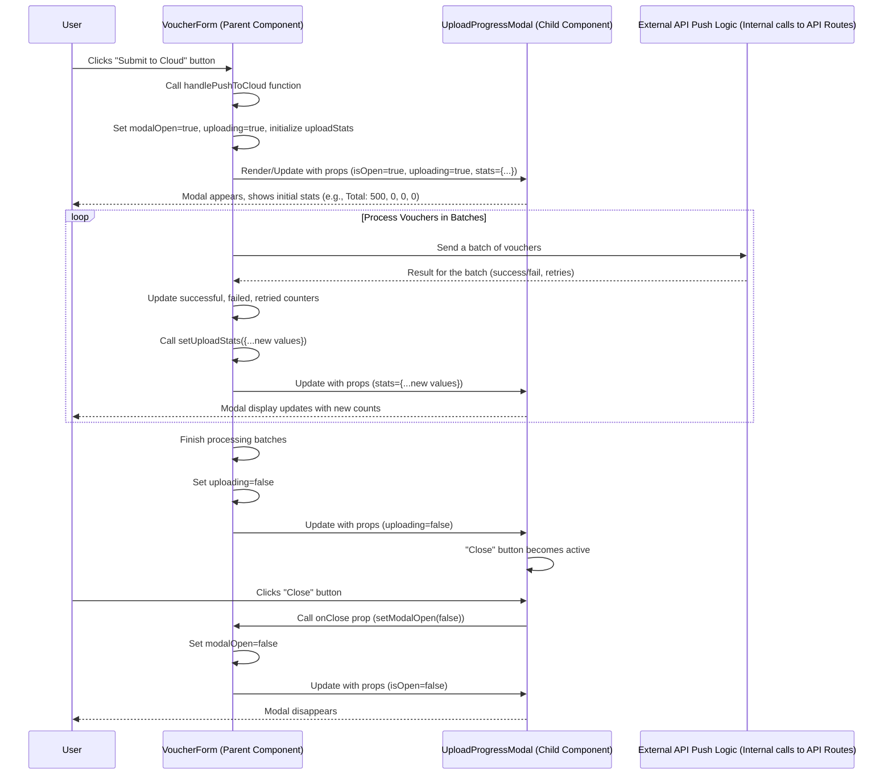

# Chapter 8: Upload Progress Modal

Welcome back! In our previous chapters, we've built up many core parts of the `merged-tally-helper` application: getting settings ([Chapter 1: Environment Configuration](01_environment_configuration_.md)), managing selections ([Chapter 2: Voucher Selection State](02_voucher_selection_state_.md)), talking to the database ([Chapter 3: Database Access](03_database_access_.md)), handling user login ([Chapter 4: Authentication System](04_authentication_system_.md)), communicating with external systems ([Chapter 5: External API Integration](05_external_api_integration_.md)), keeping a log of syncs ([Chapter 6: Voucher Sync Logging](06_voucher_sync_logging_.md)), and building the visual elements using ShadCN and Tailwind ([Chapter 7: User Interface (ShadCN/Tailwind)](07_user_interface__shadcn_tailwind__.md)).

Now, let's combine some of these concepts to create a specific, helpful part of the user interface: a window that pops up to show you what's happening *while* you're pushing data to the cloud.

## The Problem: Waiting for a Long Task

Imagine you've selected 500 vouchers and clicked the "Submit to Cloud" button. This process involves sending each voucher (often in batches) to an external API, which can take some time, especially if the network is slow or the external system is busy.

What does the user see during this time? If nothing happens, they might think the application is frozen or the button didn't work. This is a frustrating user experience.

We need a way to:

1.  **Inform the User:** Let them know the process has started.
2.  **Show Progress:** Give them a visual update as the task proceeds.
3.  **Display Results:** Show a summary of how many items were processed successfully, how many failed, etc.

Without this feedback mechanism, potentially long-running asynchronous tasks like pushing data make the application feel unresponsive and unclear.

## What is the Upload Progress Modal?

The **Upload Progress Modal** is a dedicated pop-up window (a "modal" or "dialog" in UI terms) that appears when a data push operation begins. Its purpose is to display real-time statistics about the process.

Think of it like a **live dashboard for your data push delivery**. Instead of just seeing a "Sending..." message, you get updates on:

*   Total vouchers being processed.
*   How many have been successfully uploaded.
*   How many failed.
*   How many retries occurred.

This provides crucial visual feedback and lets the user monitor the progress without guessing.

## The Use Case: Showing Live Stats During Data Push

The primary use case is straightforward: when the user clicks "Submit to Cloud", a modal appears, showing statistics that update dynamically as the application communicates with the external Tally Cloud APIs ([Chapter 5: External API Integration](05_external_api_integration_.md)).

## Key Components

Implementing this requires bringing together several pieces:

1.  **A Modal Component:** A reusable UI element that looks and behaves like a pop-up window. We'll use the `Dialog` component from ShadCN UI ([Chapter 7: User Interface (ShadCN/Tailwind)](07_user_interface__shadcn_tailwind__.md)).
2.  **State to Control Visibility:** A variable in the parent component (`VoucherForm`) that tells the modal whether it should be visible or hidden.
3.  **State to Hold Statistics:** Variables in the parent component (`VoucherForm`) that store the counts (total, successful, failed, retried).
4.  **Props to Pass Data:** The modal component needs to receive the visibility state and the statistics state from its parent via props.
5.  **Logic to Update State:** The `handlePushToCloud` function (which initiates the data push - [Chapter 5](05_external_api_integration_.md), [Chapter 6](06_Voucher_Sync_Logging_.md)) needs to update the statistics state as batches of vouchers are processed.

## The `UploadProgressModal` Component (`components/shared/UploadSummaryLayout.tsx`)

Let's look at the simple component responsible for rendering the modal. It's designed to be reusable across different pages (India Sales, India Return, Nepal Sales, etc.).

```typescript
// components/shared/UploadSummaryLayout.tsx (Simplified)
import * as React from "react";
// Import ShadCN Dialog components (Chapter 7)
import {
  Dialog,
  DialogContent,
  DialogHeader,
  DialogTitle,
  DialogFooter,
} from "@/components/ui/dialog";
import { Button } from "@/components/ui/button"; // ShadCN Button (Chapter 7)
import { Loader2 } from "lucide-react"; // Loading spinner icon

// Define the properties (props) this component expects
interface UploadProgressModalProps {
  isOpen: boolean; // Should the modal be open?
  onClose: () => void; // Function to call when the modal should close
  stats: { // Object containing the statistics
    total: number;
    successful: number;
    failed: number;
    retried: number;
  };
  uploading: boolean; // Is the upload currently in progress?
}

// The functional component
export default function UploadProgressModal({
  isOpen,
  onClose,
  stats,
  uploading,
}: UploadProgressModalProps) {
  return (
    // ShadCN Dialog: Controls visibility based on 'open' prop
    <Dialog open={isOpen} onOpenChange={() => !uploading && onClose()}>
      {/* ShadCN DialogContent: The modal panel itself */}
      <DialogContent className="max-w-md rounded-lg bg-white shadow-lg border border-blue-200">
        {/* ShadCN DialogHeader: Title section */}
        <DialogHeader>
          {/* ShadCN DialogTitle */}
          <DialogTitle className="text-blue-700 text-lg font-semibold">
            Upload Progress
          </DialogTitle>
        </DialogHeader>

        {/* Main content area for stats */}
        <div className="space-y-4 px-4 py-2 text-gray-800">
          {/* Displaying stats passed via props */}
          <div className="flex justify-between border-b border-blue-100 pb-2">
            <span>Total Vouchers</span>
            <span className="font-medium">{stats.total}</span>
          </div>
          <div className="flex justify-between border-b border-blue-100 pb-2">
            <span className="text-green-600 font-semibold">
              Successful Uploads
            </span>
            <span className="font-semibold text-green-600">
              {stats.successful}
            </span>
          </div>
          {/* ... Display failed and retried stats similarly ... */}
          <div className="flex justify-between border-b border-blue-100 pb-2">
            <span className="text-red-600 font-semibold">Failed Uploads</span>
            <span className="font-semibold text-red-600">{stats.failed}</span>
          </div>
          <div className="flex justify-between">
            <span className="text-blue-600 font-semibold">Retries</span>
            <span className="font-semibold text-blue-600">{stats.retried}</span>
          </div>

          {/* Show spinner and text while uploading */}
          {uploading && (
            <div className="flex items-center gap-2 mt-4 text-blue-700">
              <Loader2 className="animate-spin" size={20} />
              <span>Uploading...</span>
            </div>
          )}
        </div>

        {/* ShadCN DialogFooter: Button area */}
        <DialogFooter>
          {/* ShadCN Button: Close button */}
          <Button
            variant="outline"
            onClick={onClose} // Call the onClose function prop
            disabled={uploading} // Disable closing while uploading
            className="w-full"
          >
            {uploading ? "Uploading, please wait..." : "Close"}
          </Button>
        </DialogFooter>
      </DialogContent>
    </Dialog>
  );
}
```

**Explanation:**

*   This component is a standard React functional component that receives `props`.
*   It imports the necessary ShadCN `Dialog` components and a `Button`.
*   The `Dialog` component from ShadCN handles the core modal behavior (showing/hiding, overlay). Its `open` prop is directly controlled by our `isOpen` prop.
*   The `onOpenChange` prop of `Dialog` is used to handle when the user tries to close the modal (e.g., by clicking outside or pressing Escape). We only allow it to call our `onClose` function if `uploading` is `false`, preventing accidental closure mid-upload.
*   Inside `DialogContent`, we use basic HTML structure (`div`, `span`) and apply Tailwind classes ([Chapter 7](07_user_interface__shadcn_tailwind__.md)) for layout (`flex`, `justify-between`, `space-y`), spacing (`px`, `py`, `pb`), borders (`border`), colors (`text-green-600`, `bg-white`), and shadows (`shadow-lg`).
*   The statistics (`stats.total`, `stats.successful`, etc.) are displayed by reading the `stats` object passed through props.
*   A loading spinner (`Loader2` icon) and "Uploading..." text are conditionally displayed based on the `uploading` boolean prop.
*   The "Close" button's text and disabled state also depend on the `uploading` prop.

This component is purely presentational; it just displays the data it's given. It doesn't manage the upload process itself. That logic happens in the parent component.

## Managing Modal State in `VoucherForm`

The `VoucherForm` component (like `components/india/VoucherForm.tsx` or `components/nepal/VoucherForm.tsx`) is responsible for initiating the data push. It needs to control when the modal is shown and update the stats it displays.

This is done using React's `useState` hook to manage the modal's state.

```typescript
// components/india/VoucherForm.tsx (Simplified - relevant state)
"use client";

import { useState } from "react";
// ... other imports ...
// Import the modal component
import UploadProgressModal from "../shared/UploadSummaryLayout";

export default function IndiaVoucherForm() {
  // ... other state (dateRange, vouchers, loading, pushing, syncMeta)

  // State for controlling the modal's visibility
  const [modalOpen, setModalOpen] = useState(false);
  // State for indicating if upload is active (disables closing modal)
  const [uploading, setUploading] = useState(false);
  // State for holding the statistics to display
  const [uploadStats, setUploadStats] = useState({
    total: 0,
    successful: 0,
    failed: 0,
    retried: 0,
  });

  // ... rest of the component logic (handleFetch, handleExport, handlePushToCloud)
  // ... useVoucherSelection hook (Chapter 2)

  return (
    <>
      {/* ... rest of the VoucherForm JSX (Cards, Inputs, Buttons, Table) ... */}

      {/* Render the UploadProgressModal component */}
      <UploadProgressModal
        isOpen={modalOpen} // Pass the modal visibility state
        onClose={() => setModalOpen(false)} // Function to close the modal
        stats={uploadStats} // Pass the current statistics state
        uploading={uploading} // Pass the uploading status
      />
    </>
  );
}
```

**Explanation:**

*   We declare three state variables using `useState`:
    *   `modalOpen`: A boolean, initially `false`, controlling if the `Dialog` is open.
    *   `uploading`: A boolean, initially `false`, indicating if the push process is active. This is used to disable closing the modal during the process.
    *   `uploadStats`: An object, initially `{ total: 0, successful: 0, failed: 0, retried: 0 }`, holding the counts displayed in the modal.
*   The `UploadProgressModal` component is rendered within the `VoucherForm`'s JSX.
*   We pass our state variables (`modalOpen`, `uploadStats`, `uploading`) as props to the `UploadProgressModal`.
*   We also pass a function `() => setModalOpen(false)` as the `onClose` prop, allowing the modal component to request closure (which we handle externally).

## Updating Modal State During Push

The core logic that drives the modal's real-time updates lives within the `handlePushToCloud` function in the `VoucherForm` component. This function initiates the process of sending vouchers to the external API, often in batches. As each batch is processed, the `uploadStats` state is updated.

Here's a simplified look at the relevant parts of `handlePushToCloud`:

```typescript
// components/india/VoucherForm.tsx (Simplified - relevant parts of handlePushToCloud)
  const handlePushToCloud = async () => {
    if (!selectedInvoiceNos.length) {
      toast.error("Select vouchers to push");
      return;
    }

    // 1. Open the modal and indicate uploading started
    setModalOpen(true);
    setUploading(true);
    setPushing(true); // Disable the main push button

    try {
      const selected = vouchers.filter((v) =>
        selectedInvoiceNos.includes(v.InvoiceNo)
      );

      // ... (Duplicate check logic using syncMeta - Chapter 6) ...
      if (duplicates.length > 0) {
        // ... show error ...
        setUploading(false); // Turn off uploading status
        return; // Stop here if duplicates found
      }

      const batchSize = 50;
      let successful = 0;
      let failed = 0;
      let retried = 0;

      // 2. Initialize stats shown in the modal
      setUploadStats({
        total: selected.length,
        successful,
        failed,
        retried,
      });

      // 3. Loop through batches and push data (calling external API route - Chapter 5)
      for (let i = 0; i < selected.length; i += batchSize) {
        const batch = selected.slice(i, i + batchSize);
        const payload = prepareSalesPayload(batch); // Prepare data for API (Chapter 5)

        // Call the API route to push this batch, possibly with retries
        const result = await submitWithRetry(payload); // submitWithRetry includes API call logic (Chapter 5)

        // 4. Update stats based on the result of this batch push
        if (result.success) successful += payload.length;
        else failed += payload.length;
        retried += result.retries; // submitWithRetry returns number of retries

        // 5. Update the state, which triggers modal re-render with new stats
        setUploadStats({
          total: selected.length,
          successful,
          failed,
          retried,
        });

        // Note: In the actual Nepal form, there are two calls (purchase/sale) per batch,
        // so stats are updated after EACH call to show more granular progress.
      }

      // ... (Check if all failed, show error) ...

      // 6. If overall push was successful, save the sync log (Chapter 6)
      const now = new Date().toISOString().split("T")[0];
      await fetch("/api/sync-log", { /* ... */ });

      // 7. Indicate upload finished and reset states
      toast.success("Vouchers pushed successfully!");
      setSelectedInvoiceNos([]); // Clear selection (Chapter 2)

    } catch (err) {
      // ... error handling ...
      toast.error("Failed to push to cloud");
    } finally {
      // 8. Ensure pushing/uploading status is turned off whether success or failure
      setPushing(false); // Re-enable main push button
      setUploading(false); // Allow closing the modal now
      // Modal remains open until user clicks close or onOpenChange allows it
    }
  };
```

**Explanation:**

1.  When `handlePushToCloud` starts, it immediately sets `modalOpen` and `uploading` state variables to `true`. This makes the `UploadProgressModal` component visible. It also sets `pushing` to `true` to disable the main "Submit" button.
2.  Before the loop, `uploadStats` is initialized with the total number of selected vouchers.
3.  The code then loops through the selected vouchers, often processing them in batches.
4.  Inside the loop, after each batch is sent to the external API via the `/api/.../cloud` route (using `submitWithRetry`, which handles the actual `fetch` or `axios` call from [Chapter 5](05_external_api_integration_.md)), the result (success/failure, number of retries) is checked.
5.  The `successful`, `failed`, and `retried` counters are updated based on the batch result.
6.  Crucially, `setUploadStats({...})` is called *inside the loop*. Each time this state updater is called, React sees that the `uploadStats` state has changed in the `VoucherForm` component. Because `uploadStats` is passed as a prop to `UploadProgressModal`, the modal component receives the new `stats` prop value and re-renders, updating the numbers displayed to the user.
7.  After the loop finishes and other steps (like saving the sync log - [Chapter 6](06_Voucher_Sync_Logging_.md)) complete, the code shows a success toast and clears the selection ([Chapter 2: Voucher Selection State](02_voucher_selection_state_.md)).
8.  In the `finally` block (which runs regardless of success or error), `setPushing(false)` and `setUploading(false)` are called. `setUploading(false)` allows the user to finally close the modal. The modal itself doesn't automatically close on success; the user needs to click "Close".

This pattern of updating a state variable inside an asynchronous loop is how the modal provides near-real-time feedback on the data push process.

## How It Works (Under the Hood)

Let's visualize the interaction between the user, the `VoucherForm`, and the `UploadProgressModal` during a data push:



1.  The user clicks the "Submit" button.
2.  The `handlePushToCloud` function in `VoucherForm` starts.
3.  `VoucherForm` updates its state (`modalOpen`, `uploading`, `uploadStats`) to show the modal and initialize stats.
4.  React sees the state change and re-renders the `VoucherForm`. It renders the `UploadProgressModal` component, passing the updated state as props.
5.  The `UploadProgressModal` becomes visible in the browser, displaying the initial stats.
6.  `handlePushToCloud` enters a loop, processing vouchers in batches. For each batch, it calls internal logic that interacts with our backend API routes ([Chapter 5](05_external_api_integration_.md)) to push data.
7.  After receiving the result for a batch, `handlePushToCloud` updates its internal counters (`successful`, `failed`, `retried`).
8.  It then calls `setUploadStats` with the new counter values. This is the key step for live updates.
9.  React sees the `uploadStats` state change in `VoucherForm`. It re-renders `VoucherForm`, which in turn re-renders `UploadProgressModal` with the *updated* `stats` prop.
10. The modal displays the new counts. This repeats for every batch.
11. Once all batches are processed, `handlePushToCloud` finishes the final steps (like saving the sync log - [Chapter 6](06_Voucher_Sync_Logging_.md)) and sets `uploading` to `false`.
12. `VoucherForm` re-renders `UploadProgressModal` with `uploading={false}`. The modal's "Close" button is now enabled.
13. The modal remains open until the user clicks the "Close" button.
14. Clicking "Close" calls the `onClose` prop (`setModalOpen(false)`).
15. `VoucherForm` updates `modalOpen` to `false`, triggering another re-render.
16. `UploadProgressModal` receives `isOpen={false}` and hides itself.

## Summary of Key Components

| Component/Concept        | Role                                                               | Where to find it                                         | Analogy                   |
| :----------------------- | :----------------------------------------------------------------- | :------------------------------------------------------- | :------------------------ |
| `UploadProgressModal`    | Displays the statistics in a pop-up window. Purely presentational. | `components/shared/UploadSummaryLayout.tsx`              | The Live Status Screen    |
| ShadCN `Dialog`          | Provides the underlying structure and behavior for the modal pop-up. | `components/ui/dialog.tsx` (used *by* `UploadProgressModal`) | The Pop-up Window Frame   |
| `VoucherForm` Component  | Initiates the push, manages modal state, and updates stats during the process. | `components/india/VoucherForm.tsx`, `components/nepal/VoucherForm.tsx`, etc. | The Task Manager          |
| `modalOpen` State        | Boolean state in `VoucherForm` controlling if the modal is visible.  | `VoucherForm` component (`useState`)                     | The "Show Status" Switch  |
| `uploading` State        | Boolean state in `VoucherForm` indicating if the process is active. Used to disable closing. | `VoucherForm` component (`useState`)                     | The "Process Active" Light |
| `uploadStats` State      | Object state in `VoucherForm` holding the counts (total, success, fail, retries). | `VoucherForm` component (`useState`)                     | The Count Trackers        |
| Props (`isOpen`, `onClose`, `stats`, `uploading`) | How `VoucherForm` passes state information down to `UploadProgressModal`. | Component props definition | The Data Wires            |
| `setUploadStats` Call    | Called repeatedly in `handlePushToCloud` to update statistics and trigger modal re-renders. | Inside `handlePushToCloud` loop | The Counter Increments    |
| External API Push ([Chapter 5]) | The asynchronous task whose progress is being reported.            | API routes like `/api/india/cloud` (called by `handlePushToCloud`) | The Delivery Trucks       |
| UI Styling ([Chapter 7]) | Tailwind classes and ShadCN provide the look and feel of the modal.  | `components/shared/UploadSummaryLayout.tsx` JSX (`className`) | The Visual Appearance     |

## Conclusion

In this chapter, we learned about the **Upload Progress Modal**, a key UI element that provides crucial feedback to the user during potentially long data push operations. You saw how a dedicated modal component (`UploadProgressModal`) uses ShadCN `Dialog` components and Tailwind CSS ([Chapter 7](07_user_interface__shadcn_tailwind__.md)) to display information. More importantly, you understood how the parent `VoucherForm` component manages the modal's visibility and the statistics being displayed using React's `useState` hook, updating these stats dynamically within the asynchronous data push logic ([Chapter 5](05_external_api_integration_.md), [Chapter 6](06_Voucher_Sync_Logging_.md)) to provide a live progress report.

Giving the user clear feedback on ongoing tasks makes the application feel responsive and reliable. Now that we've covered how the UI displays status and interacts with data, let's look at another important aspect of the application structure: ensuring users only access the data and features relevant to them based on their region. In the next chapter, we'll explore [Regional Routing & Access Control](09_regional_routing___access_control_.md).

---