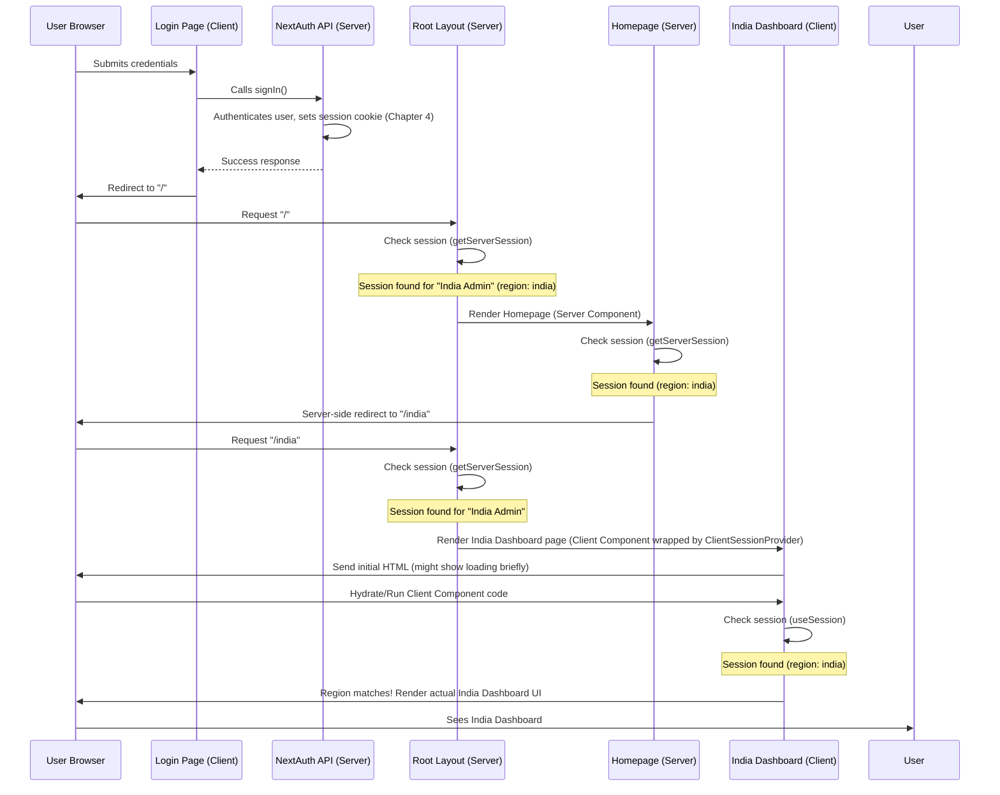
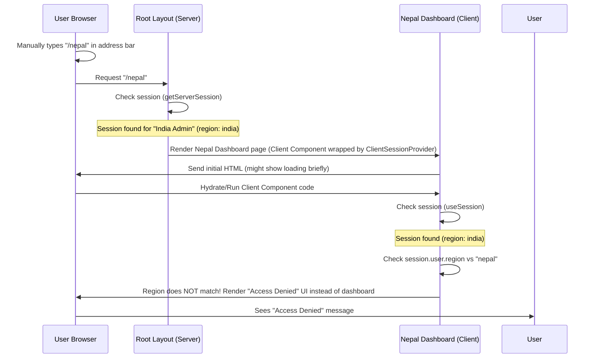

# Chapter 9: Regional Routing & Access Control

Welcome back! In our last chapter, [Chapter 8: Upload Progress Modal](08_upload_progress_modal_.md), we saw how the user interface provides live feedback for tasks like pushing data. Before that, we covered getting data from the database ([Chapter 3: Database Access](03_database_access_.md)), communicating with external services ([Chapter 5: External API Integration](05_external_api_integration_.md)), and, importantly, knowing *who* is logged in using the authentication system ([Chapter 4: Authentication System](04_authentication_system_.md)).

Now, let's link that knowledge of user identity to *what* parts of the application they are allowed to see and interact with. The `merged-tally-helper` project is designed to handle data for different regions (India, Nepal, or potentially others, plus an 'All' view). A user assigned to 'india' shouldn't see or manage Nepal vouchers, and vice-versa.

## The Problem: Directing Users and Restricting Access

Imagine the application is like a large office building designed for different departments (India, Nepal, All).

1.  **Guiding Users:** When a user logs in, they shouldn't just land in a generic lobby. They should be directed to *their* specific department floor (the India dashboard if they are an India admin, the Nepal dashboard if they are Nepal admin, etc.).
2.  **Restricting Access:** Once they are on a specific floor, they should only be able to access the rooms and documents relevant to that department. An India admin shouldn't be able to just type in the URL and jump to the Nepal floor, nor should they see Nepal-specific forms or data if they somehow got there.

Without a system for directing users based on their role/region and preventing access to restricted areas, the application would be unorganized and insecure, allowing users to potentially view or manipulate data they shouldn't.

This is where **Regional Routing & Access Control** comes in.

## What is Regional Routing & Access Control?

In `merged-tally-helper`, **Regional Routing & Access Control** is the system that uses:

1.  The user's assigned `region` (obtained during authentication - [Chapter 4: Authentication System](04_authentication_system_.md) and stored in the session).
2.  The application's folder structure in Next.js App Router (`app/(root)/india`, `app/(root)/nepal`, `app/(root)/all`).

...to **route** the user to their correct dashboard upon login and to **control access** to specific region-locked pages.

Think of it as the **building's navigation and keycard system**:

*   Your user account's `region` is like your **employee ID card** which is encoded with your department (India, Nepal, All).
*   The different folders like `app/(root)/india/` and `app/(root)/nepal/` are the **different floors or wings** of the building.
*   The system checks your ID card at the entrance to direct you to your floor (Routing).
*   Even if you try to go to another floor, the system checks your ID card again at that floor's entrance to see if you have access (Access Control).

## Key Concepts & Implementation

This system is implemented using a combination of Next.js App Router features and checks against the user's session data.

### 1. User Region from Authentication

As we saw in [Chapter 4: Authentication System](04_authentication_system_.md), when a user successfully logs in via the Credentials Provider, the `authorize` function fetches the user's details from the database, including their `region`. This `region` is then added to the user's session object via the `callbacks.jwt` and `callbacks.session`.

Any server component can get this session using `getServerSession`, and any client component within the `ClientSessionProvider` can get it using `useSession`.

```typescript
// Example from Chapter 4: Accessing region in a component
"use client"; // Client component
import { useSession } from "next-auth/react";

export default function AnyComponent() {
  const { data: session } = useSession(); // Get session data
  const userRegion = session?.user?.region; // Access the region

  // ... use userRegion for logic or display ...
}
```

```typescript
// Example from Chapter 4: Accessing region in a Server Component
import { getServerSession } from "next-auth";
import { authOptions } from "@/lib/authOptions";

export default async function AnyServerComponent() {
  const session = await getServerSession(authOptions); // Get session data
  const userRegion = session?.user?.region; // Access the region

  // ... use userRegion for logic ...
}
```

This `userRegion` is the fundamental piece of information driving the routing and access control.

### 2. Next.js App Router Structure

The application's main authenticated pages are organized using route groups (`(root)`) and sub-folders for each region:

```
app/
├── (auth)/
│   └── login/
│       └── page.tsx    # Login page (unauthenticated)
└── (root)/             # Authenticated routes
    ├── page.tsx        # Root authenticated page (handles redirect)
    ├── india/
    │   ├── page.tsx    # India Sales Dashboard
    │   └── return/
    │       └── page.tsx # India Return Dashboard
    ├── nepal/
    │   ├── page.tsx    # Nepal Dashboard
    │   └── return/
    │       └── page.tsx # Nepal Return Dashboard (Note: Nepal only has one page in this project's current state, but structure allows more)
    └── all/
        ├── page.tsx    # All Sales Dashboard
        └── return/
            └── page.tsx # All Return Dashboard (Note: All only has one page in this project's current state)
```

*   The `(root)` folder is a "route group" (indicated by parentheses). It doesn't affect the URL path itself but is used here to apply a layout (`app/(root)/layout.tsx`) that requires authentication to all pages within it.
*   `/india`, `/nepal`, `/all` directly map to the URLs users will visit (`/india`, `/nepal`, `/all`).
*   `/india/return` maps to `/india/return`, and so on.

This folder structure provides the distinct pages for each region that we need to protect.

### 3. Access Control in the Root Layout

The first line of defense is in the main authenticated layout (`app/(root)/layout.tsx`). This layout wraps *all* pages under the `(root)` group.

```typescript
// app/(root)/layout.tsx (Simplified)
import { getServerSession } from "next-auth";
import { redirect } from "next/navigation";
import ClientSessionProvider from "@/components/ClientSessionProvider"; // Provides useSession
import { authOptions } from "@/lib/authOptions"; // Auth config

export default async function RootLayout({
  children,
}: Readonly<{ children: React.ReactNode; }>) {

  // Check for session server-side before rendering any child page
  const session = await getServerSession(authOptions);

  // If no session, redirect to login page
  if (!session) {
    redirect("/login");
  }

  // If session exists, render the page content wrapped in ClientSessionProvider
  return (
    <html lang="en">
      <body>
        <ClientSessionProvider session={session}>
          {children} {/* The requested page content goes here */}
        </ClientSessionProvider>
      </body>
    </html>
  );
}
```

**Explanation:**

*   This is a Server Component (`async` function).
*   It uses `await getServerSession(authOptions)` to check if the user is authenticated *on the server*. This happens before sending the page HTML to the browser.
*   If `session` is `null` (no valid session cookie found), it immediately calls `redirect("/login")`. This prevents unauthenticated users from accessing *any* page under the `/` route group.
*   If a session exists, it proceeds to render its children (`{children}`), which will be the actual page component (e.g., `app/(root)/india/page.tsx`). It also wraps the content in `ClientSessionProvider` ([Chapter 4: Authentication System](04_authentication_system_.md)) so client components can use `useSession`.

This ensures only logged-in users can get past the root layout.

### 4. Routing on the Homepage

The `app/(root)/page.tsx` file corresponds to the `/` route *after* the user is authenticated (because the root layout already handled the unauthenticated case). This page's sole purpose is to read the user's region and redirect them to their specific dashboard.

```typescript
// app/(root)/page.tsx
import { authOptions } from "@/lib/authOptions";
import { getServerSession } from "next-auth";
import { redirect } from "next/navigation";

export default async function Home() {
  // getServerSession is already checked in root layout, but harmless here too
  const session = await getServerSession(authOptions);

  // This redirect should technically not be hit if the root layout works,
  // but is a safeguard.
  if (!session) {
    redirect("/login");
  }

  // Get the user's region from the session
  const region = session.user.region;

  // Redirect based on the user's region
  if (region === "india") {
    redirect("/india");
  } else if (region === "nepal") {
    redirect("/nepal");
  } else if(region === "all"){
    redirect("/all");
  } else {
    // Handle unexpected regions (optional, but good practice)
    return (
      <p className="text-center mt-20 text-red-600 font-semibold">
        Unknown region: access denied.
      </p>
    );
  }
}
```

**Explanation:**

*   This is also a Server Component.
*   It gets the `session` object using `getServerSession`.
*   It reads the `region` property from `session.user`.
*   It uses `redirect()` from Next.js to send the user's browser to `/india`, `/nepal`, or `/all` based on their region.

This provides the initial regional routing *after* successful authentication.

### 5. Access Control on Region-Specific Pages

Even though the user is routed, they could still try to manually type `/nepal` into the browser address bar if they are an India admin. The next layer of access control happens *on* each regional page component (`app/(root)/india/page.tsx`, `app/(root)/nepal/page.tsx`, etc.).

These page components are **Client Components** (`"use client"`), as they manage state for the UI elements (like voucher selection - [Chapter 2: Voucher Selection State](02_voucher_selection_state_.md)) and use hooks.

```typescript
// app/(root)/india/page.tsx (Simplified)
"use client"; // This page is a client component

import { useSession } from "next-auth/react"; // Hook for accessing session
// ... other imports for UI components and context ...

export default function IndiaDashboard() {
  // Get the session data using the client-side hook
  const { data: session, status } = useSession();

  // Check the user's region from the session data
  // Wait for session to load (status === 'loading') before checking
  if (status === 'loading') {
      return <div className="text-center mt-20">Loading user data...</div>;
  }

  // If session is loaded but region doesn't match "india"...
  if (session?.user?.region !== "india") {
    // Display an "Access Denied" message instead of the dashboard
    return (
      <div className="flex flex-col items-center justify-center h-screen">
        <h1 className="text-2xl font-bold mb-2">Access Denied</h1>
        <p className="text-gray-600 mb-4">
          You do not have access to this page.
        </p>
        {/* Link back to homepage or login */}
        <Link href="/">
          {/* ShadCN Button */}
          <Button>Go to Home</Button>
        </Link>
      </div>
    );
  }

  // If the region *does* match "india", render the actual dashboard content
  return (
    // Wrap the content with context providers needed by child components
    <VoucherSelectionProvider> {/* Chapter 2 */}
    <DashboardLayout>
      {/* ... India specific heading and UI ... */}
      <h1 className="text-2xl font-bold text-center">Welcome, India Admin 🇮🇳</h1>
      <div className="flex justify-end mb-4">
        <Link href="/india/return">
          <Button variant="outline">🔁 Go to Return Invoices</Button>
        </Link>
      </div>
      <VoucherForm /> {/* India-specific voucher form */}
    </DashboardLayout>
  </VoucherSelectionProvider>
  );
}
```

**Explanation:**

*   This is a Client Component.
*   It uses the `useSession()` hook to access the user's session data. The `status` return value is useful to know if the session data is still loading.
*   Once the session data is available (`status !== 'loading'`), it checks `session?.user?.region`.
*   If the region does *not* match the expected region for this page ("india" in this case), it returns simple JSX displaying an "Access Denied" message and a link back home. It completely bypasses rendering the actual dashboard UI.
*   If the region *does* match, it proceeds to render the normal dashboard content, including the `VoucherSelectionProvider` ([Chapter 2](02_voucher_selection_state_.md)) and the region-specific `VoucherForm` component.

The pages for `/nepal`, `/all`, `/india/return`, `/all/return` follow this exact same pattern, just checking against `"nepal"` or `"all"` respectively:

```typescript
// app/(root)/nepal/page.tsx (Simplified - Same logic as India, checking for 'nepal')
"use client";
import { useSession } from "next-auth/react";
// ... other imports

export default function NepalDashboard() {
  const { data: session, status } = useSession();
  if (status === 'loading') { /* Loading state */ }

  // Check the user's region against "nepal"
  if (session?.user?.region !== "nepal") {
    return (
      // Access Denied UI
      <div className="flex flex-col items-center justify-center h-screen">
        <h1 className="text-2xl font-bold mb-2">Access Denied</h1>
        {/* ... rest of denied UI ... */}
        <Link href="/"><Button>Go to Home</Button></Link>
      </div>
    );
  }

  // Render Nepal Dashboard UI if region matches
  return (
    <VoucherSelectionProvider>
    <DashboardLayout>
      {/* ... Nepal specific heading and UI ... */}
      <h1 className="text-2xl font-bold mb-2 text-center">Welcome, Nepal Admin 🇳🇵</h1>
      <NepalVoucherForm /> {/* Nepal-specific voucher form */}
    </DashboardLayout>
  </VoucherSelectionProvider>
  );
}
```

```typescript
// app/(root)/all/page.tsx (Simplified - Same logic, checking for 'all')
"use client";
import { useSession } from "next-auth/react";
// ... other imports

export default function AllDashboard() {
    const { data: session, status } = useSession();
    if (status === 'loading') { /* Loading state */ }

    // Check the user's region against "all"
    if (session?.user?.region !== "all") {
      return (
        // Access Denied UI
        <div className="flex flex-col items-center justify-center h-screen">
          <h1 className="text-2xl font-bold mb-2">Access Denied</h1>
           {/* ... rest of denied UI ... */}
          <Link href="/"><Button>Go to Home</Button></Link>
        </div>
      );
    }
  // Render All Dashboard UI if region matches
  return (
    <VoucherSelectionProvider>
      <DashboardLayout>
        {/* ... All specific heading and UI ... */}
        <h1 className="text-2xl font-bold mb-2 text-center">
          Welcome, All Admin IN
        </h1>
        <Link href="/all/return">
          <Button variant="outline">🔁 Go to Return Invoices</Button>
        </Link>
        <AllVoucherForm /> {/* All-specific voucher form */}
      </DashboardLayout>
    </VoucherSelectionProvider>
  );
}
```

This ensures that even if a user guesses the URL for another region, the page component itself will perform an access check using their session and prevent the dashboard UI from being rendered if their region doesn't match.

## How It Works (Under the Hood)

Let's trace the journey of a user named "India Admin" logging in and then trying to access the Nepal page.

**Scenario 1: User logs in and is routed to the correct page**



1.  The user logs in ([Chapter 4](04_authentication_system_.md)).
2.  Successful login redirects the browser to the root authenticated path (`/`).
3.  The `RootLayout` intercepts the request, checks the session server-side. Finds the "India Admin" session.
4.  The `RootLayout` renders the `app/(root)/page.tsx` (the Homepage).
5.  The Homepage checks the session, sees the region is "india", and performs a server-side redirect to `/india`.
6.  The browser requests `/india`.
7.  The `RootLayout` intercepts again, checks the session. Finds the "India Admin" session again.
8.  The `RootLayout` renders the `app/(root)/india/page.tsx` component.
9.  The India Dashboard component (a client component) runs, uses `useSession` to get the session data on the client side.
10. It checks `session.user.region`. Since it's "india", it renders the actual India dashboard content.

**Scenario 2: India Admin tries to access the Nepal page**



1.  The India Admin user is already logged in.
2.  The user manually navigates to `/nepal`.
3.  The `RootLayout` intercepts, checks the session server-side. Finds the "India Admin" session. The user is authenticated, so the layout allows rendering the child page (`/nepal/page.tsx`).
4.  The `RootLayout` renders the `app/(root)/nepal/page.tsx` component.
5.  The Nepal Dashboard component (a client component) runs, uses `useSession` to get the session data.
6.  It checks `session.user.region`. The region is "india".
7.  The component's access check logic (`session?.user?.region !== "nepal"`) evaluates to `true`.
8.  Instead of rendering the Nepal dashboard UI, the component returns the "Access Denied" JSX.

This two-layer approach (server-side auth check in layout, client-side region check in page component) effectively routes users and restricts access based on their assigned region.

## Summary of Key Components

| Component                       | Role                                                                                                | Where to find it                            | Analogy                                  |
| :------------------------------ | :-------------------------------------------------------------------------------------------------- | :------------------------------------------ | :--------------------------------------- |
| User Session (`session.user.region`) | Stores the user's assigned region after authentication.                                             | Accessible via `getServerSession` or `useSession` ([Chapter 4](04_authentication_system_.md)) | The Department encoded on your ID Card   |
| Next.js App Router Folders (`app/(root)/india`, etc.) | Defines the different URL paths and structures for each region's dashboard pages.               | Project folder structure                  | The Different Floors/Wings of the Building |
| `app/(root)/layout.tsx`         | Server component. Checks *authentication* for all `(root)` routes. Redirects unauthenticated users to login. | `app/(root)/layout.tsx`                     | The Main Entrance Security Guard         |
| `app/(root)/page.tsx`           | Server component at the root (`/`) path. Checks user's *region* and redirects them to their specific dashboard. | `app/(root)/page.tsx`                       | The Lobby Information Desk / Guide       |
| Region-Specific Pages (`app/(root)/india/page.tsx`, etc.) | Client components. Use `useSession` to check user's *region* against the page's expected region and display "Access Denied" if they don't match. | `app/(root)/india/page.tsx`, `app/(root)/nepal/page.tsx`, etc. | The Security Checkpoint at each Floor/Wing Entrance |
| `getServerSession`              | Server-side function to get session data (used in layout and homepage).                             | Used in `app/(root)/layout.tsx`, `app/(root)/page.tsx` | The Server-Side ID Check                 |
| `useSession`                    | Client-side hook to get session data (used in region-specific pages).                               | Used in client components                  | The Client-Side ID Check Hook            |
| `redirect` (from `next/navigation`) | Server-side function used to send the user to a different URL.                                      | Used in `app/(root)/layout.tsx`, `app/(root)/page.tsx` | The Server-Side Escort                   |

## Conclusion

In this chapter, you learned how the `merged-tally-helper` project implements **Regional Routing & Access Control**. You saw how the user's region, stored in the authentication session ([Chapter 4: Authentication System](04_authentication_system_.md)), is used in conjunction with the Next.js App Router structure to automatically direct users to their correct dashboard upon login and, more importantly, to restrict access to dashboards for regions they are not authorized to view. This layered approach, using server-side checks in the layout and homepage and client-side checks on individual pages, ensures that users only interact with the data relevant to their assigned region.

With our users authenticated, routed correctly, and access controlled, we can now delve deeper into the specific operations they perform within their dashboards. In the next chapter, we'll explore the **Voucher Data Logic** ([Voucher Data Logic](10_voucher_data_logic_.md)), which handles fetching, processing, and preparing the voucher information for display and submission.

---